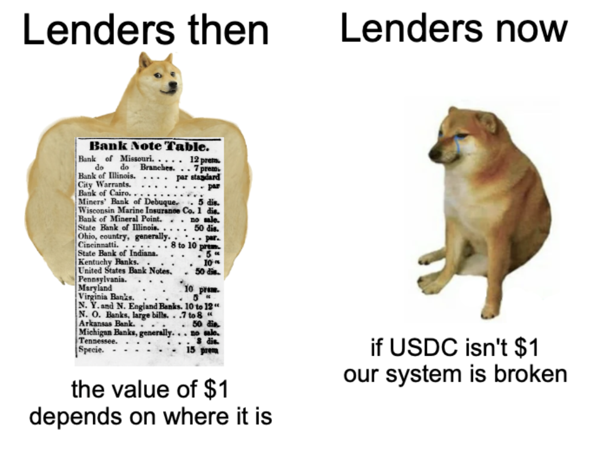

# Automated Teller Machine Machine
> sic. exploring cross layer liquidity management

## Objective
Allow users who currently have funds on rollups of varying degrees of decentralization like Arbitrum or Optimism, as well as sidechains like Polygon PoS, to enter the Credit Savings Rate at low cost and minimize latency risks.

## Concerns

Any liquidity solution with a passive quoted price faces adverse selection in the event of bad debt. This is the main argument against a simpler system where a wrapped CREDIT token is exported to various L2s. If large amounts of passive AMM liquidity are needed to make the token accessible for users, the liquidity providers are exposed in the case of bad debt.

## Mechanism
A `CreditATM` has the following mechanisms accessible on L2:

* track a share price based on deposits and reported yield
* deposit an external asset, let's say USDC, and mint a deposit receipt `dUSDC` based on the current share price
* burn `dUSDC` and receive USDC
* send USDC to the mainnet `CreditATM` (only the mainnet `CreditATM` can call this function)

If there is inadequate USDC in the ATM to support withdrawals, it's possible to sell `dUSDC` on a market. This leaves flexibility for users to manage their own liquidity needs. This means that the system defaults to a model similar to a conventional "wrapped CREDIT savings rate" in the worst case, but ideally provides direct withdraw liquidity on L2.

On L1, a parallel contract has the following mechanisms and properties:
* allow users to swap USDC and CREDIT, but not atomically, as this would expose L2 users to adverse selection in the event of bad debt originating on L1. Instead, those wishing to access liquidity in either direction must trigger a "request for liquidity auction", similar to a liquidation except no one is being penalized. It is anticipated that borrowers will be the primary users on L1, and savers the primary users on L2
* if the auction is to sell CREDIT, pull USDC from the L2 `CreditATM` based on the auction results. If the auction is to buy CREDIT, send USDC to L2 based on the results
* any CREDIT deposited in the `CreditATM` is earning the savings rate
* report earnings to L2, including savings yield and swaps yield (small tip for keeper on this), since the last time a swap occurred

## Example usage

100 different people deposit a total of 1m USDC into a `CreditATM` on Arbitrum. Their experience is similar to depositing on Compound and minting a cToken -- they mint right away and pay no fees, but push down the yield in the market they enter since there is now 1m in idle capital.

A borrower deposits $2m of stETH collateral on mainnet and mints $1m CREDIT at 4.1% interest before requesting a swap for USDC at the mainnet ATM. From a starting price of $0.50 per CREDIT, the ATM price increases until this borrower fills their order at a 0.01% swap fee, meaning they sell their $1m face value of CREDIT for 999,900 USDC. The CREDIT is automatically deposited in the CREDIT savings rate and the holders on Arbitrum begin earning interest.

The CREDIT savings rate is yielding 4%, and depositors earn for three months.

Then, a different borrower wants to repay their loan. They initiate an auction in the other direction, where the ATM initially offers CREDIT tokens for $2 for every $1 face value, and gradually decrements the price. The second borrow is in a hurry to avoid liquidation and so might have been willing to get a better deal, but end up closing at a 0.25% fee. They pay 1,002,500 USDC for the $1m CREDIT deposited by the previous borrower, and close their position.

The ATM started off with 1m USDC, and now has 1.0026m USDC, plus 10,000 CREDIT earned from the CREDIT savings rate.

## Wait, it's all bridging?
The `CreditATM` is an opinionated bridge that keeps all idle USDC (or other deposit stablecoin, like DAI) on whichever layer users deposit it on, while making it available to CREDIT minters or arbitrageurs. Borrowers or arbitrageurs decide when it is worthwhile to take on the time and costs of accessing liquidity from L2.

They may not be separate contracts, but there should be separate accounting for each asset that is available to swap for CREDIT. This mechanism is [PSM](https://mips.makerdao.com/mips/details/MIP29#paragraph-summary)-like, but cannot be used to mint CREDIT, only to buy or sell according to borrower demand.

## Conclusion
Previously, we considered the idea of "swaps terms", like a normal lending term but with 1:1 exchange and no particular owner of the collateral. I've come to see the ATM model as better for managing liquidity, while lending terms are used for yield bearing or volatile collateral assets with willing outside minters. Users can provide liquidity using any asset of their choice, without it being necessary to *mint* CREDIT against that asset, and thus expose the system to the full risk of that asset at a low collateral ratio, or else accept efficiency losses by requiring high collateralization.

Unlike a Compound cToken that targets a specific percentage of idle liquidity to facilitate smooth withdrawals, the ATM simply provides an optimized venue for people to buy CREDIT and enter the savings rate, or vice versa. There is no explicit fee management intended to control utilization or reserves percentages. Naturally, we'd expect net borrower demand to be a random walk, sometimes being positive and sometimes negative. It's possible that a more active liquidity strategy (ie, buying or selling at specific distances from peg only) can perform better, but it can also perform worse. When compared to buying their CREDIT on an AMM and staking on their own, depositing in the ATM presents a simple "no-loss" (due to swap fees, at least) strategy for passive lenders and is easily deployed to any layer. A lender can then utilize signed messages and other automation tools to schedule a withdraw for as soon as liquidity becomes available, without needing to pay an AMM swap fee.

A PSM or cToken have desirable liquidity properties from a certin perspective (mint 1:1 on demand), but are exposed to the risk of bank runs and bad debt. An ATM is based on external user deposits and conducts liquidity auctions to confirm any exchanges are at market price. Tldr; atomic composability is dead, long live asynchronous composability. Proper substack treatment of this mechanism coming after it has had some more thought.