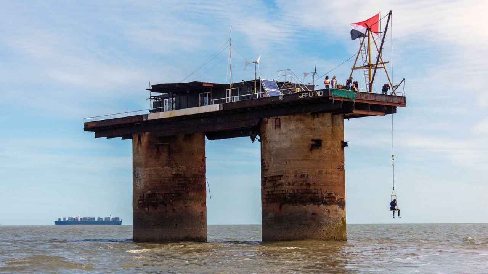
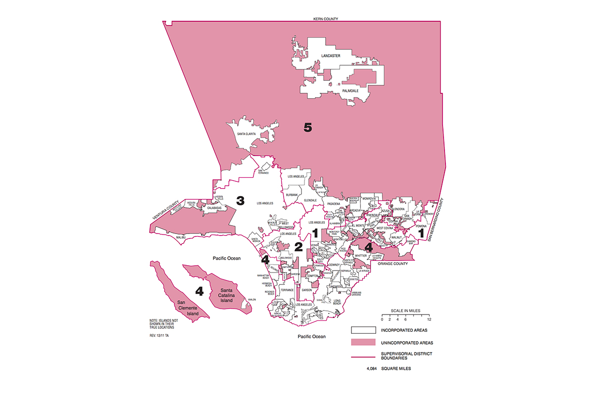
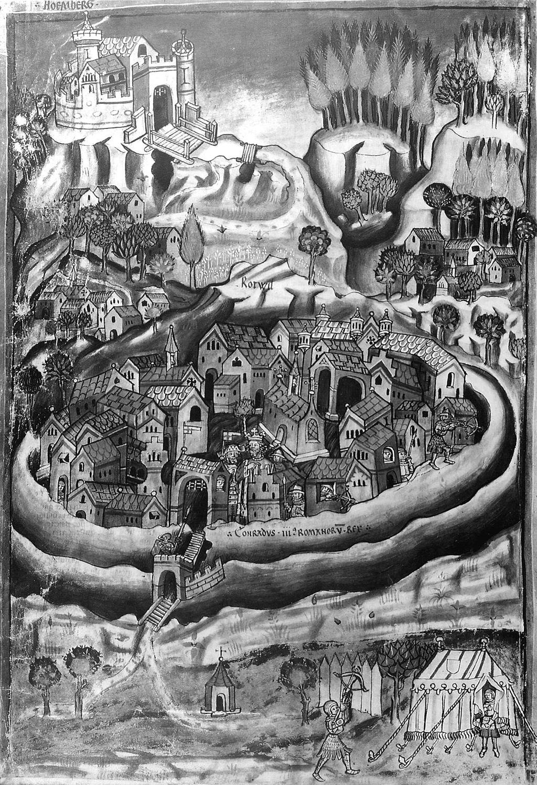

# The City of Industry
> or, your grandpa's charter city

Like many in the cryptocurrency community, I'm fascinated by governance futurism. This actually predates my interest in blockchains and even in economics. As a child I was a "micronations" fan and frequently plotted how I might take control of a remote island or atoll to establish a small republic.

In recent years I've moderated my interests to include not only (fairly implausible) attempts at new countries, but charter cities and temporary communities like [Zuzalu](https://www.palladiummag.com/2023/10/06/why-i-built-zuzalu/) and [Edge Esmeralda](https://www.edgeesmeralda.com/).

Many of my peers have likely heard of these efforts. The goal of this article is to make the reader aware of a rather older type of "charter city", which is located a mere stone's throw away from my current home.

The [City of Industry](https://en.wikipedia.org/wiki/City_of_Industry,_California) is essentially an independent fiefdom located in Southern California, dominated by a small cartel of powerful families who operate it to their own financial advantage.

It was founded with the explicit goal of providing a home for industry in Southern California while remaining free of democratic control. While the city has a mere 264 residents, is has over 60,000 daytime workers, and is a logistics and industrial hub for the Los Angeles Area. There have been reports of evictions of residents who opposed the City's dominant faction.

Quoting from a paywalled [Los Angeles Times](https://www.latimes.com/local/politics/la-me-industry-election-20150603-story.html) article:

"Since the City of Industry was incorporated in 1957, the industrial suburb of 2,500 businesses and about 400 residents has been controlled by a small group of financially connected families.

Council members sometimes serve for decades and seats are sometimes filled by the city’s business partners. Elections are conducted entirely by mail-in ballots and past races have seen unanimous or near-unanimous votes. The vast majority of voters rent property from the city or from the city’s most influential family: The Perezes."

In other words, a single family and their affiliates have control over the city's zoning and any new construction. Since the majority of existing residents are their tenants or financial dependents, they can:

1. Prevent new residents from entering
2. Personally run businesses that serve the city, such as the [waste disposal services](https://www.valleyvistaservices.com/company/), thereby extracting profits derived from taxes on local industry. Incidentally, this garbage company also serves my neighborhood even though it is outside the City of Industry proper
3. Control which businesses can operate within the city limits (often, this means enabling industries that would be too polluting to be accepted in the nearby residential cities)

In case you can't tell, I'm by no means endorsing this behavior in its entirety, but it's worth understanding from a realpolitik perspective. Despite some high profile [corruption cases](https://da.lacounty.gov/media/news/ex-assemblymember-city-manager-charged-city-industry-corruption-scheme), the ruling powers of the City of Industry are stable. Short of an action by the state government, there is nothing nearby cities can do to oust them, and no plausible democratic path to reform.

## What Industry Teaches Us

The lesson of the City of Industry is that independent incorporation is by far a more realistic path to alternative urban forms and economic activities than reform of existing jurisdictions. While new city formation in California has [become rare](https://www.calcities.org/home/post/2024/03/13/california-gets-a-new-city-for-the-first-time-in-13-years), unincorporated land is abundant even in the most populous jurisdictions.

These red zones are areas of opportunity. While I've been following projects like the [East Solano Plan](https://eastsolanoplan.com/) with interest, the process of creating a brand new city in nearly empty land between several major urban areas is both **much more expensive** and **less certain to pay economic dividends** than building within existing urban zones. The main obstacle is regulatory and local interference, which can be overcome by incorporating a new municipal entity.

There's an opportunity here for a well-capitalized entity, for example a large technology company, to do something along the lines of :

- buy up the majority of land and housing units in a given unincorporated area
- gradually move in its own employees and owners at zero or subsidized cost into these units
- incorporate the area as a micro-city
- sell the roads and other public lands within the new micro-city to the creator-entity
- after capturing control over zoning, re-develop the area and put down the skeleton of a walkable, European style city. This includes new streets (in many cases, narrower than exist in most Southern California cities), fiber internet, public transit, and parks, all on privately owned land
- work with independent developers to build a dense housing and commercial infrastructure, serving both the initial residents (the employees and associates of the city creators) and new ones

The vast majority of land in this new city would be owned by the creator-entity, allowing the whole thing to function as a "gated city", with entrance limited to employees, members, tenants, and visitors in good standing (ie, able to show ID and without a criminal record). These restrictions would not need to be enforced at the government level, but would rather be the rules of a private entity on private property. This would allow the creation of a crime-free city, perfectly clean and eminently walkable.

## Conclusion

Moving large numbers of people to experimental cities on islands or on land leased from developing country governments is a pipe dream (don't get me started on [Seasteading](https://www.seasteading.org/)). Unincorporated land in existing urban zones offers the highest return on investment for governance experimentation.

