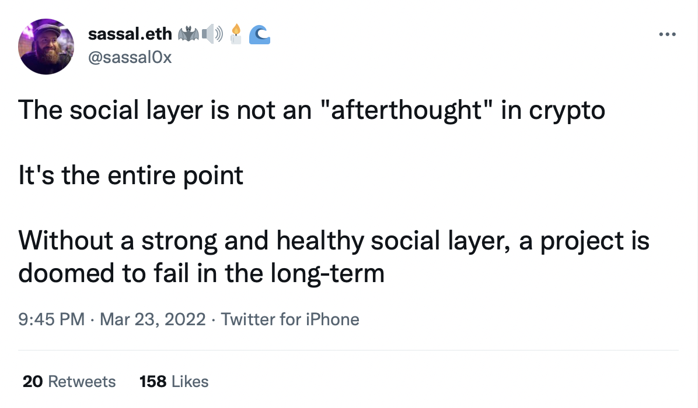

# On the Need for Token Equity

As we get closer to the launch of market governance, I am reflecting on the proper construction and role of so-called `governance tokens` in DeFi. Broadly speaking, protocols can be distinguished by what level of risk management or active change is needed in the system.

Lending protocols have the greatest need for equity-like tokens which control reserves and adjust risk parameters. Both of these operations add tremendous value for the users of the protocol, indeed are essential. It's less clear that liquid secondary markets for the reserve token are beneficial early on.

From an on chain perspective alone, [an AMM DEX](https://research.paradigm.xyz/amm-price-impact) has no need for a governance token -- what is there to govern? Pool listing is permissionless, and any fees would amount to seeking rents from the liquidity providers. The governance token provides no value to the users or to the LPs. Emissions schemes are futile to defend declining TVL.

Governance is useful to a namespace, because it is in some sense a digital commons. Anti spam or squatting measures may need to be adjusted based on changing conditions. On the other hand, is it really necessary to have liquid tokenized ownership? Perhaps we should arrive at a new understanding of so-called *exit* to community. Might the system be governed directly by its users?

With these high level thoughts in mind, let's look at some specific implementations.

# A Butterfly in its Coccoon

My thoughts are drawn to MORPHO both because of our recently completed integration, and because I am now personally earning MORPHO rewards on my VOLT (funny how skin in the game will do that to you).

Let's consider the stated purpose of the MORPHO token:

>To establish Morpho as a community-owned public good, the Morpho Association needs to decentralize the protocol it has launched. To do so, it introduced $MORPHO, the future governance token of the Morpho DAO.
>
>Later on, this token will carry out a vote to:
>* Deploy Morpho core smart contract deployments across multiple protocols and networks.
>* Curate the list of markets listed and other important parameters.
>* Decentralize the hosting of the front end to the protocol and the governance using the Morpho.eth domain.
>* Govern the DAO Treasury.
>* …
>
>Yet, this decentralization process must be carried out with the utmost care to develop the Morpho Protocol successfully. 
>
>The token initially deployed by the Morpho Association is non-transferable, and it will be up to the community to decide whether to make it transferable or not.
>
>The maximum total supply is 1,000,000,000 MORPHO. More will be released on the governance of the Morpho DAO soon.

What is the core function of this token? I will claim that like any governance token it is **risk management**. Someone has to make choices if the system is to evolve and grow over time. A well designed governance token means that decision makers have skin in the game in case of both success and failure.

For now, Morpho is configured to add no additional economic risk (of liquidation failure etc) on the underlying Compound or Aave markets. So long as this remains true, there is no particular purpose to the MORPHO token. Decentralizing the protocol could be accomplished by giving depositors veto power, and a permissionless process to submit changes.

A clear economic role for the token should be an essential consideration in my view, besides use to bootstrap the network or collect rents at maturity. In the case of a lending market, I feel quite strongly that the governance token represents a tokenized share of the reserves (equity capital).

In the case of Morpho, MORPHO auctions could be used to raise the protocol's reserves to a target level, and MORPHO holders could choose to stake in one of the Morpho markets to underwrite its risk and earn fees in that market. When reserves exceed the target, MORPHO burn might be permitted.

# The Elephant in the Room

Pondering how to design a more scalable governance system for MakerDAO and DAI was the starting point in the journey that led to VOLT. This article is about governance tokens as a form of capital, not the mechanisms of governance. In this context, we see MKR primarily as a risk share. During good times it might be bought and burnt (or at least accumulate more backing in the surplus), in bad times it will be sold and auctioned to recapitalize the protocol.

I feel this is quite backwards, and an obvious step for any lending protocol is to use token auctions to proactively reach a target level of first loss equity capital. Periodic auctions as TVL grows will almost certainly produce a better outcome than an emergency auction in the event of a loss.

This change would be easy to implement in MakerDAO today. There are some more interesting reforms we can imagine in the core governance mechanisms, but that's a story for another day.

One other point of note is the use of MKR for [emergency shutdown](https://docs.makerdao.com/smart-contract-modules/shutdown). Any user can burn (at today's prices) $45 million worth of MKR to shutdown the protocol, causing it to enter an end where DAI is directly redeemable for pro rata amounts of the backing.

This mechanism is quite odd. First of all, it's unclear under what circumstances DAI holders or borrowers in the system could benefit from executing emergency shutdown. They would need to acquire over 5% of circulating MKR (50k MKR trigger requirement) at enormous cost in order to do so -- the open market price with zero slippage being $45 million. Only the largest holders could possibly be expected to take this action in an emergency and it would still be a harsh penalty. This mechanism likely introduces an additional risk vector to the protocol. An alternative would be an Emergency Mode allowing direct redemptions if XX% of DAI stakes in a certain contract, with a fee on the DAI redeemed in this way to make any attack unprofitable while still offering a robust guarantee of exit.

In conclusion, MKR is not optimally engineered from a financial perspective and this is due to get worse with MetaDAO emissions under the Endgame plan. Imagine if MakerDAO were to use MKR auction to raise a large surplus, deploy more capital in venues with attractive yields, and turn on the DAI Savings Rate. With that we are about halfway to describing Volt Protocol ;-)

# What's in a Name?

Ethereum Name Service is an interesting case. This time I'll lead with the conclusion that it is **absolutely neccesary for it to have a token**. For a long time it worked well without a token, then did an airdrop. I sold mine! At the time, I was thinking that this was yet another extractive attempt at exiting to the community, and as I had been working unpaid on Volt Protocol for six months by the time of the airdrop, the stimulus was much welcome.

Since then my thoughts have evolved, and it all comes down to the economics of squatting. We will start with the premise that in a namespace, there must be an ongoing cost to maintain ownership of a name, otherwise squatters will rent seek to an extent that is detrimental to the public and real adoption of the namespace. If not for the fees, every dictionary word and common name combination for ENS would have been minted long before their natural users could get hold of them. Even now, many struggle with squatters, and more than one person has made a good case for reformed fee models. I recommend Vitalik's [article on the topic](https://vitalik.ca/general/2022/09/09/ens.html).

Regardless of the exact fee model, the question is, where do those fees go? They have to go somewhere, and simply destroying them would be nonsensical. The natural answer is that they go to the owners of the namespace, who are also those with the best incentive to work towards the namespace's continued adoption. Tokenizing this ownership and encoding its governance on chain is more credibly neutral than any corporate namespace. In this regard, even if the Ethereum Name Service had no governance at all and immutable fees, it would make sense to have a fee share token.

# On Immutability and Liqui(di)ty

I've been publicly skeptical about governance tokens in immutable systems. Lately I have moderated this stance, as mentioned above in the case of ENS. The heart of the matter is that, especially in a lending market, a governance token is a risk share. There's little meaning to this if there are no decisions made about risk -- but decisions about risk do not require code changes.

In the case of Liquity and LUSD, any profits from lending are distributed to LQTY stakers. However, LQTY is **not** used as a backstop for the system. Its only purpose is to be distributed in liquidity mining and boostrap early adoption. If the protocol takes on bad debt, it's not possible for it to right itself by either sacrificing some surplus reserves (my preference) or LQTY auction the way MakerDAO would.

This design could be improved as follows:

Target a certain system surplus to absorb bad debt, which might exist in the form of PCV ETH/LUSD liquidity or simply as PCV LUSD in the stability pool.

Allow LQTY to be burnt in exchange for a pro rate share of this surplus, **but only when it is above target**. Trigger periodic LQTY auctions when the system spends a certain amount of time below target. You'll notice this is similar to what I recommend for Morpho. Indeed I am confident enough to say that generally, all lending markets would be better off with a way to proactively bring in first loss capital before losses occur. It is also essential to allow it to exit when it is not needed, as the need for it is variable based on market conditions and otherwise capital will become stuck, and we would see governance tokens trading below their intrinsic value under some circumstances.

This would still permit the use of LQTY for bootstrapping liquidity, while  adding to it an enduring use in the protocol beyond rent-seeking. 

# Governor? I 'ardly know er!

The major category of governance tokens I have the least fondness for are DEX tokens. From an on chain perspective, there is no risk that needs managing in a DEX, anyone can set up whatever pools they like and swap in the same. There are no rivalrous public goods that need to be metered, like in a namespace or on a network with limited blockspace. Across the board, these tokens have been used for incentives programs at valuations far higher than their revenue could possibly justify even assuming explosive growth. To make matters worse, they are the central hotbed for the veToken model which sets small holders up to lose to more sophisticated or earlier players.

Readers might find this rancor odd after I wrote an article exploring a [Uniswap app-specific rollup](unichain.md). Part of that article's claim is that the value of Uniswap lies largely in the brand and its traction among users -- uniswap.org is probably more valuable than control of Uniswap v2 or v3. After all, how do users know when it is time to try out Uniswap v4?

Control of the user facing portions of the application, such as legal ownership of the domain name associated with the primary interface, seem like important (maybe the most important) powers for a governance token. Uniswap rates fairly well in this regard, with UNI holders able to the Uniswap ENS name as well as the Uniswap Default List. The UNI token also controls the legal ownership of the protocol code, and holders can choose whether or not to license it to any further users.

The UNI holders do not, so far as I am aware, have any rights over the Uniswap brand assets, despite some cuteness about an '[on chain brand](https://uniswap.org/blog/brand-update#an-on-chain-brand' with NFTs minted and sent to governance. Granting them these rights as well as legal control over the uniswap.org domain would be positive steps toward a real role for the UNI token.

In other words, DEX tokens have no useful role on chain, unless people are willing to buy them at inflated prices to finance rented TVL. However, tokenized ownership of key community interfaces, which could be seen as public goods or digital commons, is a real use case.

After all, *someone* has to own the DNS for a protocol, and it may as well be an SPV answerable to the protocol's tokenholders. The fact that a large part of a DEX's value lies offchain might make some uncomfortable. Others will recognize the wisdom in these words:

I won't go into other DEXs at length, except to say I regard veTokens with loathing and contempt. Renting TVL at a loss while encouraging users to buy and lock up goverance tokens for a period of years is not a good look. In the first place, total LP deposits are a meaningless metric for a decentralized exchange. Curve and Balancer both have vastly more in TVL than is needed to satisfy their organic usage, rented out at the expense of the eventual marginal buyer of emitted tokens. It seems impossible for these systems to sustain their current valuations and total deposits in the long term.

# Does Liquid Staking Require Governance?

It's not obvious to me that liquid staking protocols like Lido or Rocketpool need governance tokens.

Quick review of how these systems work:

In Lido, the validator set is permissioned and controlled by governance. LDO token primarily used for emissions, voting, and collecting fees. There is no direct economic limit on how much of the stake a single validator can use, but governance can manage such restrictions.

In Rocketpool, entering the validator set is permissionless but requires putting up both ETH and RPL collateral, in total greater than the amount of system funds the validator can use.

Consider an alternative system in which validators merely have to stake an amount of their own ETH equal to XX% of the amount of depositors' ETH they borrow. I don't believe overcollateralization is necessary, and it's likely an efficient system with 20% down or less could work perfectly well. Governance could be done directly by the rETH/stETH holders. Rocketpool made an admirable decision requiring validators to put up RPL, in that it means all of the validators participating have some governance rights. But what about rights for the rETH holders? I'm happy to see that a movement to dual governance is [under serious consideration](https://research.lido.fi/t/ldo-steth-dual-governance/2382) at Lido, though we'll see how long it takes to come to fruition. Regarding Lido, it's clear that the power to decide who can join a validation pool is valuable. It's less clear that this power couldn't go directly to the stETH holders. At the moment, governance tokens in pure liquid staking systems are fairly extractive. I would be greatly interested in seeing some of the stablecoin purists out there attempt an ungoverned liquid staking derivative with the deposit receipt itself as the governance token.

Alternatively, instead of doing away with governance tokens for liquid staking derivatives, one could move in the other direction and say that these protocols should have PCV which would eat any losses on behalf of their LSD holders, or backstop liquidity in an emergency. Once you have a first loss capital reserve, the role for a tokenized share of this reserve in governance becomes clear. You might be getting tired of hearing it by now, but we can think of liquid staking derivatives protocols as being equivalent to stablecoin issuers -- there's no reason that staking needs to be the only thing they do with the backing. For example, some people might want to short or long either ETH of staking returns, they can provide a facility for this and obtain additional yield. A portion of the backing might be kept unstaked to facilitate on-demand withdrawals. If the LSD is accepted as collateral elsewhere, the protocol might draw on a line of credit when it needs to process redemptions rather than maintain expensive incentivized liquidity pools.

# Conclusion
The legitimate roles of a governance token can in my view be boiled down to:

* risk management in a changing system (lending markets)
* the need to meter usage of rivalrous goods (blockspace, namespace)
* facilitate credibly neutral, jurisdiction-independent governance of off chain assets and procedures

Other key takeaways:

* any protocol that manages risk would benefit from reserves
* 'users' can also be governors and have a say in system changes, upgradeability alone does not require a separate governance token
* some tokens are mostly cultural assets and don't have an important role for the on chain contracts, and maybe that's okay

