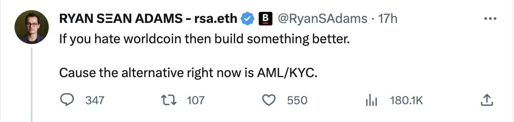

# Chrysopoeia 2
> on vain pursuits

We in crypto are in the business of big dreams and daring the "impossible", which makes it all the more vital to have a keen eye toward reality and establish where actual impossibility and contradiction lies.

The first article in this series explored why endogenous collateralization is not a desirable but yet-unrealized objective, but a [fool's errand](https://onetruekirk.github.io/chrysopoeia.html) that can only bring capital destruction. The remaining endogenously collateralized systems, like Synthetix and Beanstalk, differ from Luna/UST only in their scale and are living on borrowed time.

Today, we consider a different doomed "hero", Worldcoin, whose launch was met with well-justified derision and contempt from the crypto Twitter body politic, but earned nuanced defenses from [Vitalik Buterin](https://vitalik.ca/general/2023/07/24/biometric.html) among others. Often there is a place for nuance and meeting in the middle, but this is not it. 

## there's no such thing as secure hardware

Much like a "trustless oracle network", this is a contradiction in terms. If a limited set of entities can update onchain state in a permissioned manner, that is a trusted third party, full stop. If a physical hardware device is in the hands of a technically sophisticated adversary, they can influence the behavior of that device, full stop.

Let's see what Vitalik thinks:

>The simplest way to define a proof-of-personhood system is: it creates a list of public keys where the system guarantees that each key is controlled by a unique human. In other words, if you're a human, you can put one key on the list, but you can't put two keys on the list, and if you're a bot you can't put any keys on the list.

While simple, this definition is much too generous, because it **impossible** to ensure each key is controlled by a unique human. Even if we grant the very generous premise that no more than one key can be issued per real human, those humans can willingly give control of their keys to others, have their keys stolen through hacks, or be coerced through other means. Without someone to actively monitor and detect these things (in other words, a trusted third party) there is no way for the system to perform correctly. A physical hardware device like a Worldcoin orb can be tricked in many ways, whether physical such as the use of contact lenses, other prosthetics, and makeup, or digital, which may include specialized devices designed specifically to attack the verifying hardware.

## we don't need proof-of-unique-human

More from Vitalik:

>Proof of personhood is valuable because it solves a lot of anti-spam and anti-concentration-of-power problems that many people have, in a way that avoids dependence on centralized authorities and reveals the minimal information possible. If proof of personhood is not solved, decentralized governance (including "micro-governance" like votes on social media posts) becomes much easier to capture by very wealthy actors, including hostile governments. Many services would only be able to prevent denial-of-service attacks by setting a price for access, and sometimes a price high enough to keep out attackers is also too high for many lower-income legitimate users.
>Many major applications in the world today deal with this issue by using government-backed identity systems such as credit cards and passports. This solves the problem, but it makes large and perhaps unacceptable sacrifices on privacy, and can be trivially attacked by governments themselves.

We also hear things like:

I reject the assertion that proof of unique human is necessary. In the applications mentioned such as governance, it is not even desirable. There is a long and sordid history of wealthy or otherwise influential actors successfully capturing one person, one vote systems. If proof of personhood advocates knew the story of [Tammany Hall](https://en.wikipedia.org/wiki/Tammany_Hall#:~:text=Tammany%20Hall%20became%20a%20locally,crack%20down%20on%20Tammany%20Hall.), they might not be so quick to assume that this mechanism will produce desirable governance results. Just because there is not a free and legal market for votes, does not mean that votes cannot be bought! Blindly giving an equal vote to everyone regardless of their "skin in the game" and alignment is worse than plutocracy. Successful real world democracies rely on a civic culture, and cannot simply be transplanted into new jurisdictions or contexts.

KYC/AML is another solution in search of a problem -- a burden unfairly imposed on honest people and businesses that produces no measurable reduction in global violence and crime. The costs of AML/KYC [vastly outweigh](https://www.ledgerinsights.com/anti-money-laundering-has-less-than-1-impact-on-crime-at-what-cost/) any benefits. While we can't take a single study at face value, it is intuitive that since the majority of people and businesses are not criminals, requiring everyone to conform to onerous policies intended to restrict criminals' ability to move money would be costly. In other words, passports and other state identity controls are not something that **solves a problem**, which might be better served by a decentralized alternative, they **are a problem** created by certain humans to oppress other humans.

This leaves us only with denial of service/anti-Sybil : and if a basic pricing mechanism such as in-browser proof of work is too high a bar to clear, than surely a reliable global proof of personhood that has onboarded everyone is a much higher bar.

## UBI promises and launch monkey business

Many proof of personhood systems use "universal basic income" as part of their pitch -- nevermind the question of where the money will come from. The fact is that UBI requires obtaining physical resources in the real world and redistributing them. Once again, we have a political issue, not a technological one. I find these ill conceived pretensions at egalitarianism just as distasteful as claims that a lending protocol that uses an oracle is decentralized or immutable. The [MLM-like signup mechanisms and the structure of the Worldcoin token launch](https://twitter.com/zachxbt/status/1683512389105229825?s=20) further embitter the taste in my mouth. A work in progress business with 25% insider ownership whose core model has yet to be robustly validated should not make pretensions at being a universal public good, nor should it launch a liquid token with [FDV in the billions and large market maker allocations](https://twitter.com/AriDavidPaul/status/1683545567371075611?s=20).

## tldr

* it is impossible to confirm that a public key is controlled by a unique human, unless you are that human
* it is possible to confirm that all the humans in your jurisdiction have registered exactly one public key, but only if you are a human authority in that jurisdiction
* identity is an **imposition** by the state, not a service it provides
* one-person-one-vote is primarily ideologically motivated, there is no problem in the digital world that is best solved with proof of unique human
* Worldcoin's marketing is delusional at best