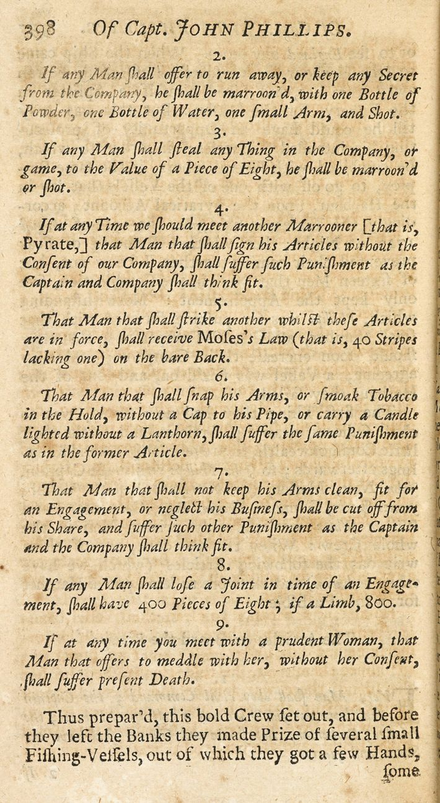

# Except by Consent of the Governed
> 24 October 2022

Disintermediation and reducing principal-agent risk are key values in decentralized finance. As such, I find it strange how little attention has been paid to minority rights and dismantling the traditional distinction between governance token (aka, equity) holders and users of platforms in the leading DeFi platforms.

Credit where credit is due: [MolochDAO](https://molochdao.com)'s [ragequit](https://twitter.com/molochdao/status/1115451404242436098?lang=en) mechanism and MakerDAO's [emergency shutdown](https://docs.makerdao.com/smart-contract-modules/shutdown), which protect the right of exit, go back years.

That said, the norm in DeFi today is no particular rights for mere 'users'. $DAI is top of my mind as MakerDAO embarks on [its Endgame](https://vote.makerdao.com/polling/QmTmS5Nf). Some are working to change this, such as [this proposal](https://research.lido.fi/t/ldo-steth-dual-governance/2382) to incorporate dual governance in Lido DAO.

There's no foolproof solution to ensure agents such as core contributors or governance voters will always respect the interests of those they govern or nominally serve, any more than there is a guarantee a wise king will have a wise heir. Checks and balances on discretionary changes are essential, and as the potential consequence of change grows, so too must the difficulty of imposing it.

## Checks and Balances

Volt Protocol is [working toward](https://community.voltprotocol.io/t/vip-xx-volt-token-migration/32) veto rights for VOLT holders as part of our vision of decentralized governance. One of the main challenges is the information asymmetry and coordination advantages that benefit major governance token holders over the 'users' who entrust their capital to the system.

Delegation systems are key to allow small holders to more effectively coordinate in opposition to undesired changes. Participants can decide for themselves who to trust to look out for their interests, leaving a more focused subset of the VOLT holder community to act as a check on the governance token holders.

In the same sense, there should be no need for all delegates to actively vote for proposals which they do not object to. A veto-based model minimizes the overhead and cost for governance actors.

## The Risk of Conflict

The downside of veto powers are when necessary or beneficial changes are blocked, effectively creating a minority tyranny if the veto threshold is too low. To prevent hostage taking, there must always be some path by which change can occur, unless an overwhelming majority is in rejection.

The initial Volt Protocol veto module will be a compromise. There will be a "fast process" for governance which is subject to veto, and a "slow process" which is not. This gives holders time to exit the system if unwanted changes are being made, while eliminating deadlock risk.

A more nuanced future version of the system might base time-to-pass for proposals on the amount of VOLT voting to veto. For example, if 1% of the supply votes to veto, delay the change going live by a week. If 5% votes to veto, delay by two weeks, and so on to a limit of never taking effect if near 100% of the supply votes to veto.

## Skin in the Game

> I assume no risks for these products myself, Mark.

While veto power is good, many frequent or small changes are infeasible to veto, such as tuning system rates, adjusting allocations between whitelisted venues, and so on. The veto power applies mostly to code changes or major decisions like offboarding existing markets.

It's essential for good governance that **those making risk decisions have skin in the game**. It's widely agreed that banks need a sufficient amount of [their own capital on the line](https://en.wikipedia.org/wiki/Tier_1_capital), yet the largest DeFi lending markets keep minimal surplus on hand, and use token sales (emission) to rent TVL instead of building up adequate reserve capital.

If Compound or Aave had a 5-10% first loss capital buffer in stablecoins being lent on their own protocol, I suspect might both take on a more cautious attitude toward long tail collateral assets. Imagine if the AAVE staking module represented shares of a stablecoin insurance buffer, and stakers took on risk per collateral asset. You're getting close to market governance.

## Is Code Law?

> A contract is a legally enforceable agreement that creates, defines, and governs mutual rights and obligations among its parties. A contract typically involves the transfer of goods, services, money, or a promise to transfer any of those at a future date. In the event of a breach of contract, the injured party may seek judicial remedies such as damages or rescission. Contract law, the field of the law of obligations concerned with contracts, is based on the principle that agreements must be honoured.
> Retrieved 02:33, October 25, 2022, from https://en.wikipedia.org/w/index.php?title=Contract&oldid=1117666752

This references 'legal' enforcement, but the making, keeping, and breaking of contracts is hardly limited to the authority of any single state or system of law. Pirates had contracts, merchants had cross-jurisdictional agreements in ancient times.

The essence of a contract is an agreement with a socially-condoned and generally effective enforcement mechanism. Smart contracts offer what in many cases is a radically better enforcement mechanism. They can reach consensus or finality with infinitely greater speed and certainty than human judicial processes. Code can be rapidly iterated on in the free market, and is accessible to anyone anywhere.

**To stablecoin holders** and other frustrated participants in today's governance: remember that you are agreeing to the rules of the smart contract system you enter into. Rather than attempt an uphill battle in a system that doesn't offer meaningful rights to all stakeholders, one can try out something new.

As I look ahead to the next century, it seems obvious that credibly neutral software is the future of international commerce and the monetary system. As I look around at the existing DeFi landscape, it feels like there is a lot of work to do. If this interests you, join us on the [Volt Protocol forum](https://community.voltprotocol.io) or [on Discord](https://discord.gg/XK8VZyKU97).