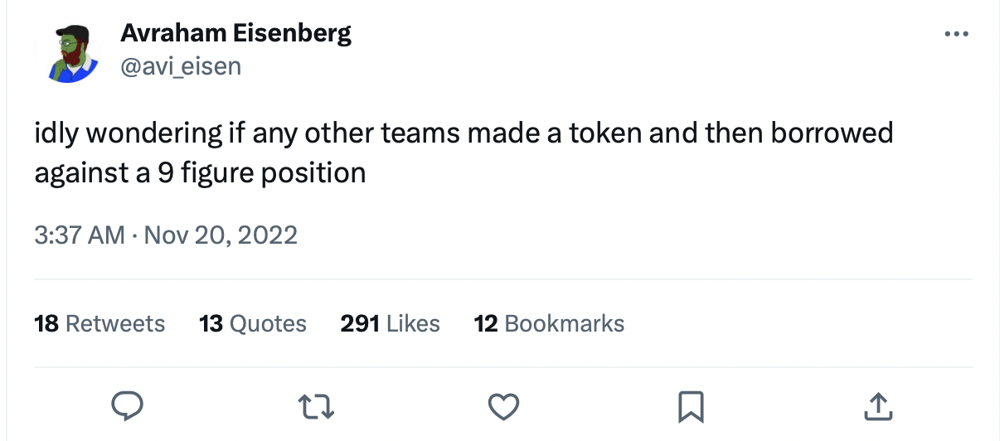
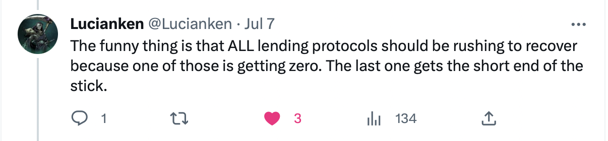

# CRV
`a lending risk case study`

You may have noticed the debate regarding Curve founder Michael Egorov's $100m+ in CRV-backed loans. This article seeks to get to the bottom of why the current sitution is risky, how it came about, where we can go from here, and how to prevent similar incidents in the future. Nothing in this article is financial advice in the sense that I do not know your personal circumstances, but it is an exhortation to be more cognizant of and take proactive steps to mitigate long tail asset risk if you are a DeFi lender or lending protocol governor.

## CRV : a history

The CRV token was deployed in August 2020. Just two months later, the Curve team made the [initial proposal](https://governance.aave.com/t/proposal-add-support-for-crv-curve-dao-token/774) to add it as collateral to Aave v2, which was passed as the first Aave v2 governance proposal. The posts in the thread by Aave team members read more like endorsements than critical analysis of risks.

In December 2020, Mr Egorov [began to borrow on Aave](https://etherscan.io/tx/0x4203c2efafa430c8a9887cf27adbccd8bae111b164cef68da7f54c5324b1eb2a). 

By the end of February 2021, he had borrowed $1,907,000. Against a collateral that had only existed for five months, this is a lot of money, but with CRV's then near-billion dollar market cap, it didn't seem like so much.

During March, he borrowed over $500,000 more.

On and on it went, and his total debt ballooned. It began to come to the notice of a few people. One of these people was Avraham Eisenberg, who saw an opportunity: short the $CRV token to liquidate Mr Egorov, which would in turn further depress the price and result in profit for his short (at minimum, he would be the only one in position to liquidate and capture the corresponding reward for a position of that size). His strategy failed, but did cause some bad debt in the Aave CRV market. Mr Eisenberg has since faced prosecution for his oracle manipulation attack on Mango Markets.

In the aftermath, Aave made the CRV tokens un-borrowable, and other markets took similar steps to derisk from long tail asset borrowability. None took particular note of long tail collateral risk.

Mr Egorov never stopped borrowing. In June, [alarm bells](https://twitter.com/lookonchain/status/1667439041527291905?s=20) [began to ring](https://twitter.com/DegenSpartan/status/1668158889085509634?s=20) in DeFi. Not long after, Gauntlet recommended [emergency steps](https://governance.aave.com/t/gauntlet-recommendation-to-freeze-crv-and-set-crv-ltv-0-on-aave-v2/13644) to derisk Aave v2, whose exposure peaked at over $65m of USD debt. This was met by substantial opposition and the proposal failed. Some accused them of [targeting Egorov](https://governance.aave.com/t/gauntlet-recommendation-to-freeze-crv-and-set-crv-ltv-0-on-aave-v2/13644/16?u=onetruekirk) in a way that violated the spirit of neutrality in DeFi. [Others](https://governance.aave.com/t/gauntlet-recommendation-to-freeze-crv-and-set-crv-ltv-0-on-aave-v2/13644/9?u=onetruekirk) claimed that the position was in fact healthy given the current CRV prive. Chaos Labs [argued](https://governance.aave.com/t/gauntlet-recommendation-to-freeze-crv-and-set-crv-ltv-0-on-aave-v2/13644/8?u=onetruekirk) that the Gauntlet proposal did not go far enough in preventing further borrowing, and that urgent steps were needed to force a partial or complete repayment of the existing position.

In the end, only a more moderate proposal of modest LTV reduction was implemented. Mr Egorov kept borrowing, but expanded his activity on Fraxlend, Abracadabra, and Inverse Finance where he found a more welcoming home, if higher interest rates.

Mr Egorov's total debt now exceeds $105 million across the Aave, Fraxlend, Inverse, and Abracadabra markets, five times the daily CRV volume. His most recent net borrow was $180,000 yesterday via [Inverse Finance](https://zapper.xyz/event/0x26e0ec5e69e142bab1a2537da2644304b0a175047d1d424c5c6e988acd2e439e:130). It should be obvious that liquidating the position would have an enormous impact upon the CRV price -- who in the world can buy $105 million worth of $CRV today? Even [His Excellency](https://etherscan.io/address/0x3ddfa8ec3052539b6c9549f12cea2c295cff5296#:~:text=Justin%20Sun%20%7C%20Address%200x3ddfa8ec3052539b6c9549f12cea2c295cff5296%20%7C%20Etherscan) doesn't have enough on hand, though perhaps he would be willing to bridge some funds over for the purpose. Mr Egorov's average borrowing rate is $3,400,000 per month. All evidence suggests that the situation will continue to grow more risky for those lenders who allow their exposure to grow or remain static as global leverage increases.

## Leverage is global

The affected lending protocols have inadequate risk management culture, lack awareness of global leverage and liquidity conditions, and in many cases do not have the proper infrastructure to respond to a changing environment. Setting aside the oracle issue for another day, at minimum, a protocol must constrain the loan to value, or per asset borrow limit (the former implicitly limiting the global debt against a certain collateral, the latter explicitly) to a safe level.

In the case of this particular asset, the global leverage has already risen to an unsafe level, meaning **no** additional debt backed by CRV should be considered safe. Protocols that already have exposure would be wise to ensure they do not get any more of it. This will result in some combination of partial repayment, increased collateralization, and rebalancing between protocols. To some extent, the situation it is a zero sum game.

That doesn't mean a panicked "bank run" is the best approach. Attempting to force a short term close of the position, whether you think this option pragmatic or persecutory, can be front run by other sellers. Instead, protocols should gradually alter parameters so as to force either partial repayment, including:
* setting LTV to zero
* gradually raising the liquidation threshold
* raising interest rates

This leaks less value and maximizes chances of optimal sales that return value to lenders. As an individual lender, all you can do is withdraw your funds from the markets in question until the situation resolves, and express your opinion on governance forums, Twitter, Discord, and so on.

## Volatile assets in general

DeFi governance tokens are not fundamentally very good collateral. Almost all of them have a large concentration of ownership in the founding team, and none have a truly broad and diverse base of holders in the way that ETH or BTC do (buyers of last resort at some low price). We could approximate this concept as the "absolute liquidity depth" -- how much total volume the market could support at any price. Market cap is largely an illusion, what matters is how much could actually be realized by selling any quantity in question. Even a premier token like UNI doesn't have a guaranteed source of $100m in buy demand. Any such purchase would be a strategic decision by a major fund or ultra-high net worth individual, that would likely require strategic alignment with the team in question. 

This means that lenders must be watchful of their users and of each other. It's no problem lending $10m against UNI -- it's a big problem if there is $200m lent against UNI, no matter where. While lending can happen offchain where no one can see it, just being mindful of all publicly available data would be a good start!

Across all assets, lenders should regularly adjust LTVs in response to global leverage conditions. Aave and Compound v2s are not capable of adjusting interest rates per asset, so they should set especially conservative LTVs and liquidation thresholds for risky assets.

## How the Credit Guild can handle long tail assets

It's impossible to obtain surety in lending against long tail assets with concentrated ownership. That doesn't mean it is to be entirely feared and avoided, but it should be kept to a conservative sizing. The [callable loan model](https://onetruekirk.substack.com/p/decentralized-credit-101) gives an advantage in that loans can be wound down without being liquidated, regardless of market price. For example, if the Credit Guild lent $10m against ARB tokens, but then a new stablecoin launched and issued $200m in loans against ARB, the ECG loans could be immediately called and the CREDIT backing safeguarded.

While situations such as Mr Egorov's are undesirable, it's good to support market making and price discovery in a variety of assets. If total CREDIT issuance against any such asset is limited to a subset of daily volume protocol risk will be low (provided global leverage does not rise to unacceptable levels, in which case the loans should be called and the lending term disabled). The Credit Guild has enough flexibility that it can have multiple lending terms at different LTVs, rates, and so on available for each collateral type. GUILD holders can choose between them in the gauge votes, allowing an appropriate configuration to emerge without extensive political argumentation.

## Do assets need to be borrowable?

In a recent Twitter discussion on this topic, Michael Bentley of Euler [argued](https://twitter.com/euler_mab/status/1677631786895962112?s=20) that a one-sided market where the collateral cannot be borrowed to short is unhealthy. Nour Haridy of Inverse [suggested](https://twitter.com/NourHaridy/status/1677667528233893888?s=20) that large asset holders do not *want* their tokens to be borrowed and sold (which we might note would depress the market price). While I agree with Michael that a healthy borrowing market in a given asset is healthy for market structure, I don't believe that's the fundamental problem here. The problem is that **lenders are pricing collateral not based on the price it could actually be sold at in the size that they hold, but simply at its unit price in the market**.

In the case of the ECG, collateral will not be rehypothecated, though we can release alternative versions of the system supporting lending of a wide range of assets, most notably ETH, which might be released not long after the Credit v1 launch.

## Conclusion

Anyone who honestly considers the situation of a protocol founder borrowing over one hundred million dollars against his own token should understand it puts lenders in a bad position. While Gauntlet has failed to rally community support for risk mitigation and instead faces backlash, setting LTV to zero is not persecutory but prudent. The purpose of this article is not to condemn Mr Egorov, who has borrowed from willing lenders at the rate that they quote, but to emphasize the risk this situation poses to those lenders, many of whom underestimate it.

