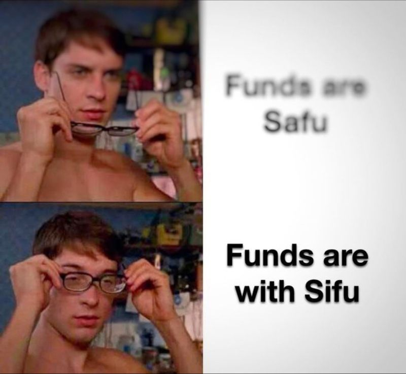
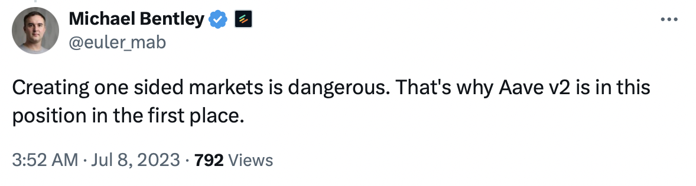

CRV
> a lending risk case study, part 2

## 1) WHAT

About a year ago, crypto Twitter was roiling with fear, doubt, and denial around the enormous debts of Curve founder Michael Egorov and the risks they might pose to lenders. I wrote about the situation at the time [here](./crv.html). At peak, his total debt exceeded $105 million.

The debt crisis was precipitated by an exploit affecting certain Curve pools, and was resolved by large OTC sales that allowed Mr Egorov to repay a substantial portion of his debt and refinance the rest. I haven't precisely calculated the low point of his debt, but estimate it around $40-60m. 

Over the course of the last year, he continued borrowing, with his total debt growing to >$90m. A large portion of his new debt was on his own lending platform, Llamalend (which, to his credit, has a genuinely interesting and useful design), with the remainder on Fraxlend, Silo, and Inverse Finance.

CRV price ranged significantly over the past year, but a few days ago finally dropped into the danger zone for liquidation of Mr Egorov's positions. Some have claimed this was caused by the UwU lend exploit, since the attacker performed a price manipulation and illegitimately borrowed a large number of tokens, including CRV which was deposited on Llamalend and used to borrow crvUSD. It's not clear to me that this was causal, since CRV price was already at its yearly low prior to the exploit.

Regardless of the proximal cause, given the extensive borrowing by the protocol founder, a downward price shock and mass liquidation were a matter of when, not if.

When the dust settled, only Llamalend took on bad debt, with other markets successfully liquidating large CRV debt positions. There remains some doubt about the solvency of certain cvxCRV collateral positions on Inverse Finance -- while not able to be liquidated based on the current market price, when slippage is taken into account the collateral cannot be sold atomically for enough to repay the debt, and since cvxCRV is not redeemable, the arbitrage demand is uncertain.

Mr Egorov has promised to repay the outstanding bad debt. We're not quite content with "all's well that ends well" here -- let's consider the lessons of these events and what lending market designers and operators can do to ensure we don't see a repeat, or worse, in the future.

## Taking notes

The first point to emphasize, also discussed in my last article on the subject, is that **leverage is global**. It's not enough to consider the amount of debt on your own platform and impose a borrowing cap against a specific collateral, you must also consider how much leverage exists against the same asset elsewhere. All liquidations are competing for the same market liquidity. In this instance, Llamalend was the one to take on bad debt simply because they had the largest overall position, but had their max LTV for CRV been lower than competing markets, they may still have been able to "front run" them on liquidations and avoided loss.

Even for high quality collateral like ETH, lending markets should be mindful of the rivalrous nature of liquidations. As DeFi lending scales vs total crypto liquidity, this form of competition will become more and more relevant.

The second point to consider is that **LTVs should reflect liquidity**, not just historical volatility. At time of writing can only sell about $2m worth of CRV atomically onchain before slippage starts becoming a threat. While there's substantial centralized exchange liquidity on top of this, and soft or partial liquidations give time for buyers to come in and participate in addition to the programmatic onchain liquidity, we can clearly tell that lending markets were playing a dangerous game lending so much against CRV tokens, and that the outcome of this liquidation cascade could have been very much worse.

The third point is that **risk managers must consider counterfactuals** and a range of possible outcomes. I've seen quite a few Twitter takes (a few during arguments I engaged in) that the situation turned out pretty well and previous discussions of the danger were exaggerated. Just because things *didn't* end in total disaster doesn't mean they *couldn't have*, or even that it was unlikely. We can't over-index on historical data and must instead reason from first principles, lest we commit grave errors as DeFi lending continues to scale. This ties into a larger argument that **risk management is scale-dependent**, and strategies that work well at a small size don't translate well as markets grow. 

## On Shorts as Financial Disciplinarians

In my previous argument on this topic, I referrenced [Michael Bentley](https://twitter.com/euler_mab)'s point that one-sided markets are inherently dangerous. There is nuance to this, since collateral rehypothecation is risky, and even a one sided market can be approached in a risk-conscious manner with the right parameters.

What I want to mention here is not about risk, but about financial discipline.

It's likely that a major motive for Mr Egorov's borrowing was to avoid depressing the CRV price (and drawing criticism from tokenholders) in the way that he would with large sales. Borrowing against them was better for PR and allowed the protocol to get more juice out of its token emissions.

Many protocols over-spend on incentives. Recently, I [criticized](https://x.com/OneTrueKirk/status/1799154832919634351) a proposal passed by the Arbitrum DAO to allocate 225M ARB to a fund for investing in onchain gaming. The passing of this proposal was swiftly followed by a ~10% decline in ARB price. One might expect that a healthy short market would allow stronger responses to excessive spending or high emissions rates. Dan Elitzer has [suggested](https://x.com/delitzer/status/1791538051283406880) that protocols bootstrap short side liquidity by allowing vesting/locked tokens to be kept as lending market deposits until unlock. While I'm skeptical this mechanism would be widely adopted, I do believe that a healthy two sided market is good for users.

Early stage volatile token markets are vulnerable to market manipulation attacks (see Avi's attacks on [Mango Markets](https://www.coindesk.com/policy/2024/04/18/mango-markets-exploiter-avi-eisenberg-found-guilty-of-fraud-and-manipulation/) and Aave, a class of risk which [Elliot](https://twitter.com/Elliot0x) and I [warned](https://github.com/volt-protocol/volt-protocol-core/blob/develop/audits/venue-audits/compound.md) both Aave and Compound teams about prior to these attacks).

Oracle free lending markets like the [Credit Guild](https://creditguild.org) and [Ajna](https://ajnafi.com) can play a valuable role in simultaneously bootstrapping long and short side liquidity for longer tail assets while avoiding this risk.

## Conclusion

While I don't think we'll see a repeat of borrowing on this scale by a protocol founder any time soon, global leverage risk will be of increasing concern as the total adoption of onchain lending markets increases, and the complexity of monitoring the global state will continue to grow. Protocol designs and sophistication of onchain risk management must grow in tandem with the market if we wish to avoid worse liquidation cascade events in the future.