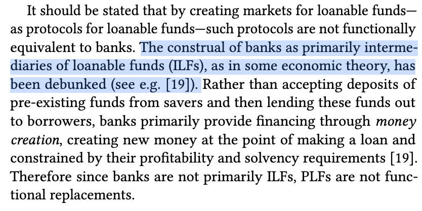

# On Lending Without Oracles
> in which we explore an adversarial lending model

[Gudgeon et al](https://arxiv.org/pdf/2006.13922.pdf) coined the term "Protocol for loanable funds" or PLF to refer to any system whereby funds can be programatically borrowed at a defined rate on a distributed ledger. Within Ethereum DeFi, the version of this that we're most familiar with is the lending pool, or lendpool for short.

Go read the paper above if you haven't, I will wait...

Pop quiz to be sure you've read and understood, please explain the significance of the following statement in your own words: "uncovered interest rate parity does not hold either within or among lendpools today".

## A Digression
> even bankers and economists have pseudoscientific beliefs about money

As an aside, the reader will notice the claim that PLFs are not equivalent to banks, because banks can engage in money creation.

Can [banks](semantics.md) [create](definitions.md) [money](yield.md)? No. Commercial banks can extend credit originating either in deposits, loans from other banks, purchases of their securities on the market, or central bank liquidity. Nowhere can they create new money independent of the central bank. At most, they are the instruments by which the central bank distributes newly created money.

For a thought experiment, consider the case of a commercial bank located outside the United States with neither a dollar deposit franchise or access to Fed liquidity. Can it reduce the value of dollars relative to other currencies by issuing lots of USD loans? Of course not. It will be destroyed by asset liability mismatch, not make alterations in the dollar money supply.

## Where PLFs Fall Short

The answer to our pop quiz is that onchain lendpools and other PLFs like MakerDAO aren't very efficient as lending markets. Cost to borrow against the same collateral fluctuates wildly between markets. Why? A few possible factors:
- incentive distortions (lending markets running at a loss to subsidize total value locked, in our view a vanity metric)
- high switching costs (gas to migrate a leveraged position between markets is substantial)
- liquidity management. Markets hold quite a bit of capital idle, with a large spread between deposit and borrow rates, preventing efficient cross market rates arbitrage

The following aren't related to uncovered interest rate parity, but additional problems with the current crop of PLFs.

## The Oracle Problem

All successful PLFs rely on either Chainlink or another trusted oracle provider. The fundamental problem with relying on a market price oracle is that markets are manipulable. We've seen "[highly profitable trading strategies](https://twitter.com/avi_eisen/status/1581326197241180160?s=20&t=DBOuVncPDrXa9dYH5706Cg)" with long tail assets so far, but the exact same problem could occur with highly liquid assets if there is enough money on the table and a motivated attacker. This issue cannot be punted on forever.

I believe that the search for a better oracle is tilting at windmills, and instead we should explore oracle-free systems. While I was once enamored with TWAL/TWAL and other onchain market data metrics, any oracle that has a calculable cost to manipulate is impossible to trust.

## The Governance Problem

The dominant PLFs, including both MakerDAO and lendpools, involve sharing of risk. All lenders are exposed evenly to all borrower positions. Any governance change in the protocol can be an existential risk, as demonstrated when Compound's cETH was [accidentally frozen](https://thedefiant.io/compound-ceth-frozen) in an inadequately tested update. There's a strong desire for immutable lending tools in the community, but existing examples of this like RAI and LUSD support only a single collateral and set of lending terms. Their inefficiency imposes negative rates on lenders and creates a scaling limit.

Is it possible to create a lending market like Uniswap, that doesn't need governance of its core primitive code? Where risk is not shared like a monopool, and yet the inefficiency and liquidity fragmentation of e.g. Kashi is avoided?

## Lending Without Oracles

How can a lending market function without oracles? After wracking my brain for a long time, the only alternative I've come up with is shifting responsibility (both the decision to do so, and the cost) for liquidating or calling loans to the lenders.

That is, instead of automatically liquidating positions at a certain CR, lenders would have the right to "call positions" for a price, a liquidation fee. Once their loan is called, borrowers can either repay and earn the liquidation fee themselves, or if they are negligent, outside liquidators will do so on their behalf.

The downside here is that purely passive lending goes out the window. Lenders must call loans before they become undercollateralized to avoid losses, and should not lend at too-low of collateral factors such that they must call loans too often and pay excessive liquidation fees.

The advantage for lenders is twofold:
- access liquidity on demand. The time-to-withdraw is always known and the bank run risk of Compound style markets is removed.
- avoid oracle dependency. There is no need to trust an external oracle feed, so assets without existing Chainlink feeds can be onboarded as collateral

For borrowers, the advantage is that they will pay no liquidation fees so long as they repay their loans on demand, and will be compensated for the inconvenience of a loan being called. The downside is that it is possible for a loan to be called at a time when the borrower does not wish to repay.

## Lending Without Governance

Lenders need to make choices about which assets to lend against and on what terms. In a lending pool this is the role of governance, but in our fantasy system, this choice must remain in the hands of the lenders. A lender must be able to define which assets they wish to lend against and on what terms, in the same way that anyone can create a Uniswap pool with an arbitrary token pair, choose between fee tiers, and LP in an arbitrary price range.

Then, borrowers must be able to efficiently match with lenders. We can look to systems with peer to peer matching like [Morpho](https://docs.morpho.xyz/concepts-overview/core-concepts), or DEX aggregators that perform routing, as interesting inspirations here.

If a given lender can fully define their own borrower collateral exposure and the rate they charge, then there is no need for governance token holders to conduct risk management. At the same time, this precludes participation by passive lenders, so this system should be seen as a base layer that can be used by sophisticated individuals, entities, and governed protocols on top.

## Noteworthy Directions

The other main direction in the lending market tech tree, as mentioned above, is using onchain data for oracles instead of trusted offchain feeds. I'm skeptical of relying on explicit and potentially manipulable onchain data for efficient lending, but it's possible it could be used to define safe boundaries for passive lending behavior. Euler has been at the forefront of [understanding oracle risk in lending markets](https://docs.euler.finance/euler-protocol/getting-started/methodology/oracle-rating), so I'm excited to see the relevance of EulerSwap in this regard.

As onchain lending continues to grow, the other thing that's relevant is keeping track of *global* leverage of the same collateral across markets. It's not clear how this would be measured transparently onchain, but we ignore cross-market manipulations or contagion at our peril as these systems continue to grow.

## Conclusion

The interests of lenders and borrowers are in conflict. If we give up on the idea of a passive lending pool and embrace the model that lenders and borrowers are sophisticated, self-interested, and at times adversarial actors, more expressive and composable lending become possible. To work well the system should be fair for both and prevent abuses, a tall order. I'm working on some specifics for this model and am looking forward to see whether it withers under criticism or proves robust.