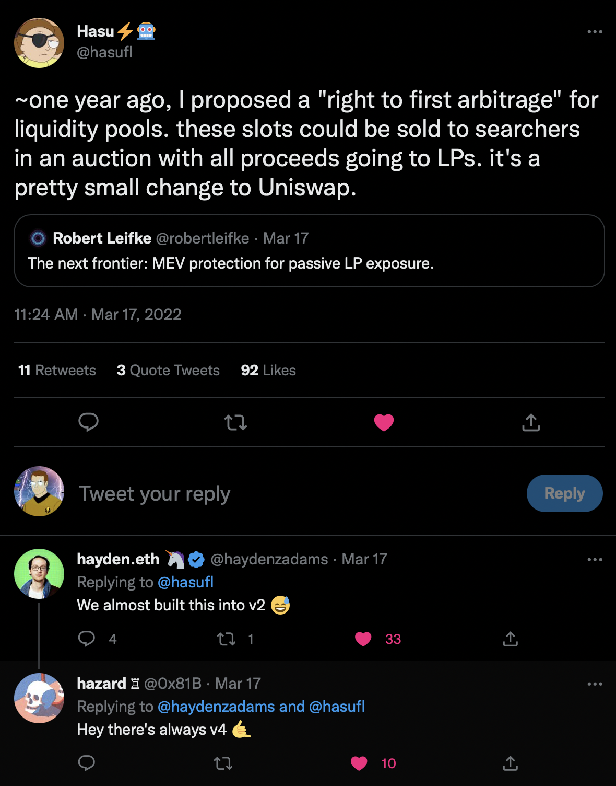

# Protocol for Liquidity Auction
>understanding market-making through an options lens

I’ve been convinced by Alex Nezlobin in this [informative discussion](https://twitter.com/OneTrueKirk/status/1597715992712396802?s=20&t=EpCZ9htCB6wNWQmvstay_A) that current LP tokens are equivalent to free options which counterparties can exercise on demand. The “fee” is part of the strike price, not a premium collected upfront. This is a problem for LPs, because agents will only exercise options at a profit to themselves, meaning a loss to the option writer.

One direction for a solution is to explicitly charge and capture an option-like premium in advance. This may cause gas efficiency concerns, but we’ll cross that bridge when we come to it.

A related proposal was made by Hasu long ago, to auction off the “right to the first arbitrage” in a block, and there is [an Ethresearch thread by Josogo at Crocswap](https://ethresear.ch/t/mev-capturing-amm-mcamm/13336) fleshing out this idea. Selling the right to first arbitrage is a good idea but doesn’t go far enough, as it still guarantees that LPs are taking some loss to arbitrage, even if it reduces this loss. It also puts all the LPs on the same footing, instead of allowing them to compete on premia as well as setting their desired strike price.

What I’m suggesting is to instead auction the “right to exclusive arbitrage” on a per-tick basis. Individual LPs are in competition based on what strike price they define, so a pool model with a collective right to first arbitrage doesn’t make sense. The best case scenario for the LP is that no trade occurs, in other words, they profit by selling an option that was not exercised. The premium they charge may also leave them in profit despite the option being exercised. Handling this on a per-tick basis means that all LPs who have defined the same strike price are bundled, which is relatively efficient while still permitting competition. Under this model, there would be no concept of separate pools with distinct fee tiers. There would be a single pool per asset pair with a set of ticks to express price.

As on Uniswap v3, a liquidity provider would supply one or more assets across one or more ticks, essentially selling one or more options. In each tick, a rolling auction will occur for the right, but not the obligation, to swap at the exchange rate in a given block. In any given block, the High Bidder in the previous block is charged the Premium and holds the right to execute the option at the strike price. Only one swap may occur per tick per block. As soon as at least one bid has occurred, the LPs have locked in a premium on their option. Bidders can withdraw their bid at any time, except if there is only one bidder, in which case they can still withdraw but must forfeit the premium. A new high bidder is in effect buying the option from the previous high bidder at the cost of the premium.

At this point, the reader might protest -- only one swap per tick per block? What happened to scaling? The answer is that scaling doesn't need to happen at the base layer, and indeed cannot. It is already abundantly clear that directly swapping on DEXs on layer one Ethereum is not a scalable approach for retail users to transact. A correct foundation must be established before scale is possible, and a system that is fair for professionals can be the basis for retail-friendly services on top.

Once the option is exercised, whoeever excercised it is free to make further use of the liqudity. For example, they can participate in a Cowswap style swap and match with limit orders submitted from offchain that they already had in hand, and which motivated them to bid. In the same sense, a market maker seeking to fill orders on centralized exchanges will bid for access to any onchain liquidity they can use to fill those orders at a profit.

The core code for this system could be immutable, and thus should not extract any rents. Ideally, neutral and open infrastructure standards could be widely adopted by profit-seeking actors existing on top of the base layer, whether companies, individuals, or token-protocols.