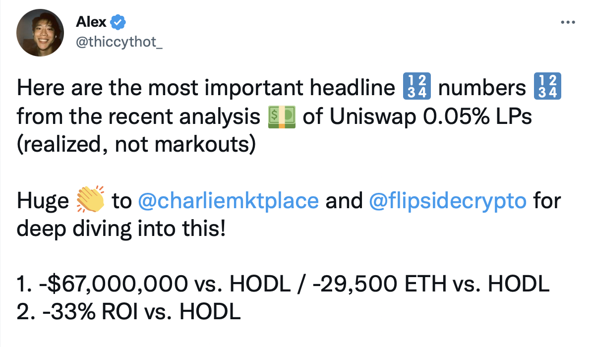
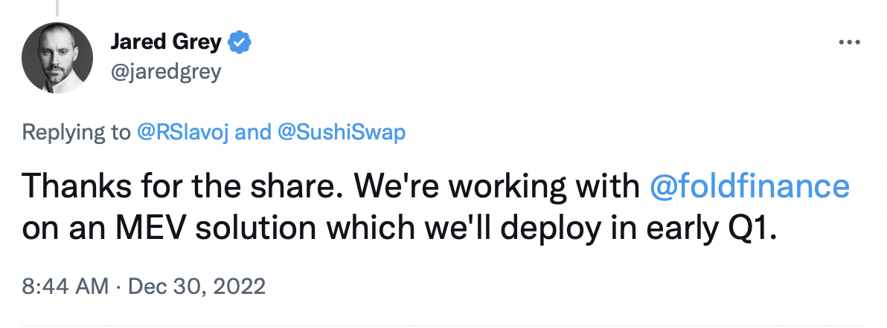
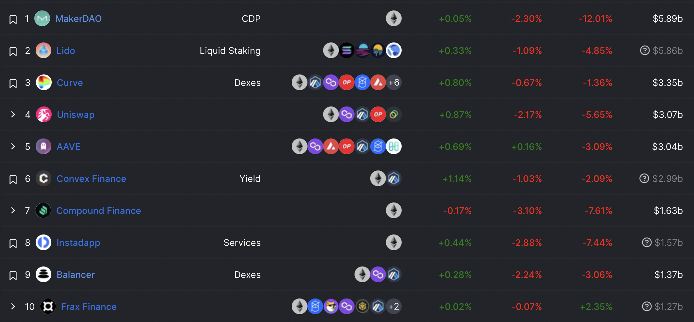

<!-- Google tag (gtag.js) -->

# So You've Made a Valueless Token -- Now What?

Happy New Year to all readers. The short, darker days and the general market conditions have had me thinking about the topic of endings and beginnings.

## Zombie Protocols
More proximally, the recent proposal toward ["tokenomics" reform](https://forum.sushi.com/t/sushi-tokenomics-redesign/11621) at Sushiswap has drawn my ire. Liquidity provision in Uniswap and in similar decentralized exchanges is [loss-making](https://onetruekirk.github.io/liquidityauction.html) in the absence of subsidies.

How loss-making exactly?

If liquidity providers are losing so much, who is making the money? Mostly arbitrageurs buying on a decentralized and selling on a centralized exchange (or vice versa), as well as the miners/validators who can earn a higher bid on an arbitrage bundle.

The Sushi team is working on an effort to capture a portion of the [miner extractable value](https://docs.flashbots.net/new-to-mev) currently leaked by liquidity providers, but until the method is published I'll remain skeptical that they can return more than a portion of the losses liquditiy providers take currently.

Providing immutable software that is used for exchange is not a basis for long term rent collection. Sushi itself began as a fork, so even in the best case that Sushi unveils an MEV solution that radically improves returns vs Uniswap, it's hardly clear that long term value capture should occur.

Where do we go from here? In my eyes, $SUSHI might have been better left to wither after Chef Nomi's ignominious retreat. The only result of perpetuating its existence is passing the hot potato between holders as the team extracts what value they can, and only those holders who can find a greater fool exit at profit. At a certain point, the most ethical outcome is for existing holders to mark down their loss and shut things down. By continuing to promote their token as a speculative investment while having no demonstrable basis to support the growth of its value, the team aren't doing themselves or the rest of us any favors.

## Dead Protocols
> or, where things went wrong

Volt Protocol and I got our foot in the door in the DeFi community in large part thanks to [Jai Bhavnani](https://twitter.com/Jai_Bhavnani) of Rari Capital and [Joey Santoro](https://twitter.com/joey__santoro) of Fei Protocol, which merged to form the Tribe DAO not long after I started collaborating with Jai.

Things got too big, too fast. Failures in security and economic diligence led to [massive loss of funds](https://rekt.news/fei-rari-rekt/) and ultimately, the closure of both protocols. There was major controversy and political strife over the use of Tribe DAO funds that originated in FEI Genesis to repay Fuse losses. Ultimately, the coalition of the Fuse victims prevailed, likely thanks to the efforts of DCF God, OlympusDAO, and Sam Kazemian. TRIBE holders took the hit while Fuse lenders and FEI holders redeemed at par.

While there is a lot we could complain about in how that all went down, in this article, we're less interested in how the spoils were divvied up than why the decision was made to shut things down, and how the shutdown was handled by protocols that had integrated FEI or Fuse.

A shutdown was necessary. FEI's mechanism had failed, and an uncapped Genesis was a dangerous idea to begin with. Rari Capital code had already been twice exploited and its brand tarnished. Especially since Tribe DAO was sitting on a large treasury even after fully reimbursing Fuse hack victims and repaying its FEI liabilities, returning the remaining value to holders as soon as possible was the responsible thing to do.

After the shutdown was announced, some strange behavior was observable, such as the residual FEI lenders on Compound getting stuck until the market could be fully deprecated and the remaining FEI borrowers liquidated. Protocols that had integrated FEI had to go through offboarding procedures, including Volt Protocol and Morpho. All in all, FEI redemption was smooth and integrators didn't have too hard of a time winding down exposure.

Protocols that had been building on Fuse were less fortunate, and more than one saw the trust of their users destroyed and the efforts invested in their Fuse pools wasted.

One of my biggest lessons from this cycle was that composability breeds complexity, and complexity kills. Fuse was modified from the Compound codebase, and most existing lending protocols receive frequent updates and tunings in governance proposals. This is a scary prospect for a depositor or integrator, and I see the appeal of immutable systems like LUSD or RAI. Unfortunately, the complexity of the world requires that systems be able to change even for them to survive, let alone to grow.

There's no easy answer, and hindsight is 20/20, but if all of the protocol teams integrating Fuse had done deep code-level diligence before doing so, maybe the exploit could have been caught and prevented. We at Volt Protocol are seeking to bring a high level of peer scrutiny to all of the protocols we integrate with, as well as setting up active testing, monitoring, and simulation infrastructure to help keep track of governance changes or market fluctuations.

## Protocols Gone Private

There's only one path I can see for $SUSHI (and many similar protocols) that doesn't mean perpetual extraction of value from the existing or future tokenholders, which is for the brand to be applied to an actually profitable underlying activity.

Whether this means the brand gets acquired by an entity with the proper capitalization and motivation to get value out of it, or Sushi acquires a truly promising product with real traction that needs growth capital, I don't know. It's laughable to think that the current $200m+ valuation can be supported, and already too late for those who bought in at or above current prices unless a greater fool can be found. The only positive way out is to apply the value of the brand to a legitimate productive business. sushi.com, the $SUSHI token, and the platform's current liquidity have significant value. How much value? Hard to say, but the brand value could be estimated based on how many trades are routed directly through the Sushiswap frontend, as well as the "stickiness" of the remaining liquidity once incentives are removed.

The case of FiatDAO is relevant here. It was incubated by Barnbridge and then [merged into it](https://forum.barnbridge.com/t/combine-fiat-dao-into-barnbridge/807). In this case, the Fiat team had a product vision but not enough funds to pay their wages, while Barnbridge lacked product market fit on its existing suite and had no indication of a clear forward vision. Who can play Fiat to Sushi's Barnbridge? Maybe a novel and more sophisticated decentralized exchange platform could use the Sushi brand. Unlike the Fei-Rari merger, the Barnbridge-Fiat merger wisely imposes a 365 day vest on those who convert their FDT to BOND.

## Live Players and Protocols Yet to Come
> on secrets and plans

As you can gather, I enjoy building in public and discussing ideas openly from an early stage. There's already more written information than any of us can hope to consume, and by combining our signal-processing efforts, we can go further. While it may have to do with an effort to avoid giving the impression that the tokens they've created are securities, it's sad to me to see teams like Uniswap building so much in secret. I expect it will be the cooperative and iterative work of many, not the secret garage project of a few, that gets us to a truly decentralized financial ecosystem.

When I first got started in DeFi, for some reason I tended to assume that the final frontier had already been reached in various categories. If the oracle problem was solvable, surely all three of MakerDAO, Compound, and Aave wouldn't need to rely on trusted oracles. If there were a better way to implement a decentralized exchange than an AMM, someone would have given it a try.

What I've seen since has completely changed this view -- we really are early. We can do much better than what exists today. We can and will create truly decentralized, market based onchain economies, where interest rates and risk are managed organically according to user preference. We can and will create trading experiences on decentralized exchanges better than their centralized counterparts. We can and will free ourselves from dependence on trusted oracles. We can and will tokenize and onboard a vast diversity of real world assets in diverse jurisdictions. We can and will develop robust decentralized identity and accreditation standards. We can and will create smooth and reliable payments services. We can and will make secure wallets with truly great user experience.

Uniswap, Euler, and Morpho are the DeFi teams with established public presence I'm most excited about today. In each case, I have high hopes that they will be able to push the envelope in their respective categories with something really new and powerful, and a few suspicions of what they will look like (hint: it involves oracle/MEV cleverness). Some of the quieter work that fascinates me is happening in the wallet world, and I plan to spend time getting my head fully around Aztec and related scaling solutions in the near future.

In five years' time, I'd be surprised to see more than two of the protocols listed below remain in the top ten. The game is afoot, and the true dimension of competition may not be what you think it is. To paraphrase Samo Burja, greatness requires both a secret and a plan, but the secrets are laid out plain to see, if only we will look! By this I mean in [books](https://oll.libertyfund.org/title/white-the-theory-of-free-banking-money-supply-under-competitive-note-issue), [forum posts](https://ethresear.ch/t/mev-capturing-amm-mcamm/13336), and [podcasts](https://twitter.com/OneTrueKirk/status/1597715992712396802?s=20&t=-3pbE636vACJnpk2dJ03GQ). If you're interested in getting to the bottom of things, I am always eager to discuss ideas here in the comments, or on [Twitter](https://twitter.com/OneTrueKirk).

