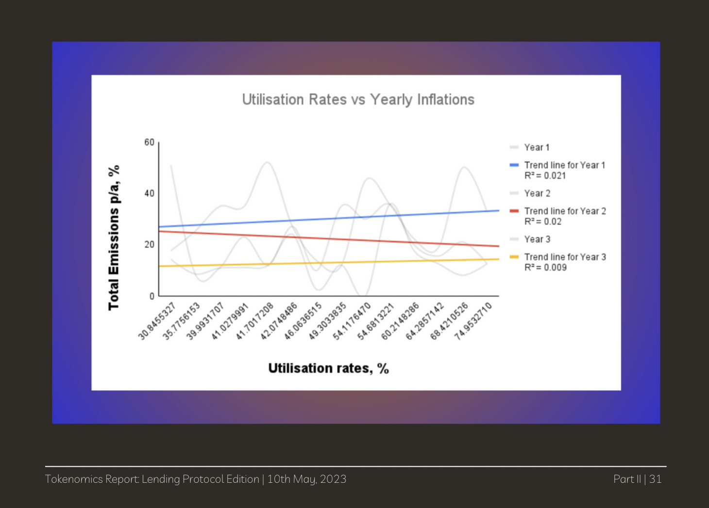

# Tokenomics Report: Lending Protocol Edition
## Author: Psaul Ogun

This is a peer review article as part of the second Credit Salon. See all the submitted articles and my reviews [here](https://onetruekirk.github.io/). You can comment below with your own thoughts. This article is reviewing a report on lending market tokenomics by [Psaul Ogun](@psaul26ix). Read the original submission [here](https://drive.google.com/file/d/1UwJusd5oEQLDIOxATz5J13oB5VJIBP83/view).

Blurb from the author:

>The content is a long from report showcasing 14 different lending protocols across DeFi at the time. I analyse the protocol mechanisms with a focus on their tokenomics and the overall token designs. The report concludes with a few mental models to approach community, product life cycles, and token design.  Note: I focused on the token side and areas I felt comfortable with but learning more intricate dynamics concerning lending protocols is an interest of mine. If you want to see another example of my work, please DM me for a sample of the current report I’m working on.

I'll start by saying that the report is excellent, and the few criticisms I will express below are the exception rather than the rule. This report makes for a good introduction to DeFi lending, and would be useful for any new entrant to the space looking to make an informed choice of which lending market to deposit or invest in.

## Unity of AAVE and stkAAVE

The report describes Aave as a "dual token" model due to the distinction between the plain AAVE token, and the staked form stkAAVE. Since AAVE can be staked or unstaked, I would prefer a different terminology that emphasizes the similarity between mechanisms like stkAAVE and the MKR mint emergency backstop.

To me, it is useful to divide lending market governance based on the role of the token in the protocol, and whether participants can opt in or out of risk.

stkAAVE, much like SNX staking, gives users the *option* to go risk on in exchange for yield (or dilution protection, depending on how you look at it). It isn't really a separate token, but rather an additional role for the same token, making it a core part of the protocol rather than using it exclusively for incentives + future rent extraction.

We might add a category for "security module/first loss capital", where AAVE would be described as "native token optional staking", MKR "native token default exposure", and Notional as "LP token insurance fund".

A note to the reader: I tend to disapprove of both native token backstop, and of native token LP backstop, because **the moment when you need to sell the native token to recapitalize the protocol, is also when we'd expect it to have the lowest price**. MKR buy-and-burn tends to buy high, sell low. It's better for a lending market to maintain a strong "cash" reserve (in the same denomination as the borrowed asset). See [Hasu's article](https://uncommoncore.co/a-new-mental-model-for-defi-treasuries/) on this topic.

## The Good Stuff

With that small critique out of the way, let's focus on one of my favorite parts of the report, the analysis of token emission efficacy. "[T]here is no
statistically significant correlation between token emissions and utilisation rate."

What should builders and investors take away from this? Mainly that **long term user demand cannot be controlled with incentives**. Token incentives are needed to bootstrap a market's starting liquidity and conquer the chicken and egg problem, but a high ongoing emissions rate will not drive more real usage. Protocols would be better served selling tokens strategically to fund further development as well as capitalize and insurance fund for rainy days, as opposed to incentivizing high levels of yield-chasing deposits.

Another important point made in the report: "If teams want to prioritise
decentralisation, they should consider using token designs that have a clear and effective way of increasing in value." You read that right : if you want a large and active base of tokenholders, the token needs to have a clear role in the protocol beyond participating in episodic governance votes. Ideally there should be more than one utility in the protocol, and opportunities for differentiated risk behavior among tokenholders.

## Conclusion

Our sample size in lending markets is still small to observe global trends, and the industry young. There is much room for experimentation in incentive schedules, first loss capital/insurance fund rules, and so on. I hope that future market designers take the time to carefully read reports like these and learn from those who have come before them.

The biggest thing missing from this report from me is MakerDAO, still the venerable king of DeFi lending. While many put stablecoins and lending in separate categories, I will make the case that stablecoin issuers with significant lending activity have more in common with Aave than they do with the likes of Circle. Circle is essentially a custodian, not a risk manager, but Maker engages in extensive risk management and frequently alters the backing of DAI. Especially now that lending subdaos like Spark are operational, Maker remains in a strong position as a lending leader.

