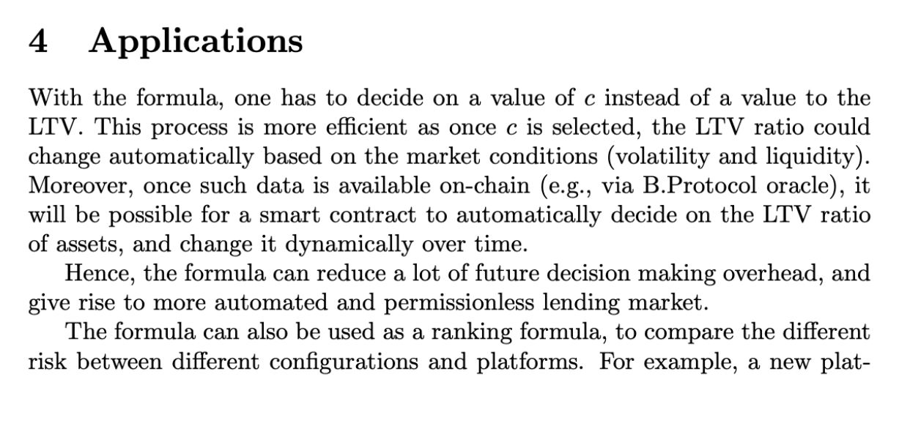

# A Smart Contract Formula for LTV Ratio
## Subnmitter: Yaron Velner

This is a peer review article as part of the second Credit Salon. See all the submitted articles and my reviews [here](https://onetruekirk.github.io/). You can comment below with your own thoughts. This article is reviewing SmartLTV, created by Risk DAO and submitted by [Yaron Velner](https://twitter.com/yaron_velner
). See the full submission [here](https://github.com/Risk-DAO/Reports/blob/main/a-smart-contract-ltv-formula.pdf).

Blurb from Yaron:

>SmartLTV is a smart contract that calculates loan-to-value (LTV) ratios based on objective measurable quantitative risk-related data feeds and a subjective risk appetite, recently deployed on mainnet to set LTVs for Morpho Blue markets. 
>
>Economic Risk Management in DeFi is still done off-chain, manually, & within a black box framework, not aligned with the DeFi ethos. 
In the upcoming Credit Salon #2 we  would like to present how zk proofs can be used to put volatility data onchain as part of this simplified yet robust smart contract solution that automates the risk management process, adding transparency and mitigating the human factor and the bias it entails.

## Spherical Cows and Efficient Formulae

This was my most anticipated submission for this year's Credit Salon, and it does not disappoint. I had reviewed the LTV oracle at a high level, but enjoyed being able to take the time to go through the math in detail for this review. If you have a hard time following the formulae, please don't blame yourself -- I made use of ChatGPT to work through the proof, and I encourage you to do the same when approaching technical articles. A personal tutor available 24/7/365 is the most marvellous thing for an independent researcher.

There are countless data points that might be used to inform a loan-to-value calculation, and simplifying these to an equation that is tractable for onchain calculation is quite the task.

To accomplish this, Risk DAO has some "spherical cows", like assuming a liquidation will not alter asset price, or ignoring the user composition of a particular market. This should not be seen as a negative per se, since it is essential to eliminate complexity for onchain calculation, but it's worth remembering that this equation is not information-complete and should act as a guide or bound rather than an absolute rule.

## Simplifying the Scope of Human Input

The SmartLTV oracle requires users (by this, I mostly mean protocols or lending pool operators) to set their own *c*, or confidence value, and combines this with neutral data that could be reported by an oracle (whether Chainlink or Uniswap style), such as realized asset volatility or available liquidity.

Anyone with experience in DAO governance can see the merit of simplifying the scope of decision making to a single parameter, while otherwise automating adjustments based on available data.

## Thoughts on application

I'm very curious about what Yaron said in the blurb about using zero knowledge proofs to put volatility data onchain. In the meantime, what occurs to me is a pessimistic accounting method. While I am religiously opposed to trusted Chainlink-style oracles, this seems an ideal use case for trustless oracles like Uniswap TWAP and TWAL, which when tracked over a short period are manipulable, but when tracked over a longer period provide a good neutral data source to adjust LTV. A pessimistic approach would mean an asset's LTV is the lower of a value set by governance and the value suggested by the oracle, making manipulation difficult while gaining the benefits of automation.

There is one very important thing that is not included in this forumla, which is global leverage and the risk of concurrent liquidations impacting price and driving down liquidity. The assumptions of "no price impact from liquidation, liquidity refilled from CEX" are close to being true for well distributed assets like ETH, and become increasingly questionable the more concentrated the asset supply and the higher the percent of supply being used as collateral.

While it is probably impossible to reliably incorporate asset distribution into the formula, it does seem that global leverage and liquidation competition from other lenders is could be included.

In the context of the Credit Guild, this makes me interested in designing an "automated lending term" for high quality assets like ETH and LSTs, where instead of GUILD holders needing to propose a new lending term when market conditions change, users staking on the term can adjust their *c* value at any time to adjust the term's allowed LTV (and perhaps other parameters like the interest rate) on a pro rata basis.

