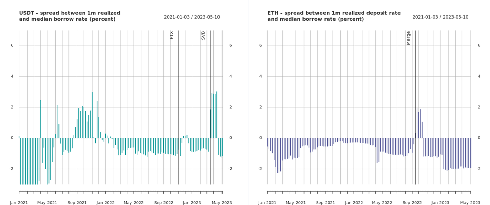

# How to Avoid DeFi Liquidity Squeezes
## Author: Billy Welch

This is a peer review article as part of the second Credit Salon. See all the submitted articles and my reviews [here](https://onetruekirk.github.io/). You can comment below with your own thoughts. This article is reviewing an article by [Billy Welch](https://twitter.com/bwelch13) describing the downsides of utilization based rates models. See the full submission [here](https://www.term.finance/post/avoiding-defi-liquidity-squeezes).

Blurb from author:

>Analysis of liquidity shocks in Aave. Also collaborated on the design of Term finance, a fixed rate lending protocol.

## One Reserve Requirement Does Not Fit All

Utilization based rates, as noted in [my review of Jalil's DeFi lending risk article](https://onetruekirk.github.io/salon2/creditrisk.html), do not necessarily reflect the risk in a given market. Depending on how the utilization curve is set, they may tend to be too low for long periods of time, and then spike to extremely high levels during periods of heightened withdrawal demand. Is this too high a price to pay for reliable atomic withdrawl? I think yes, and so does Term Finance.

Utilization based rates have similar pitfalls to traditional banks, where the first users who want to withdraw can do so, while those who are slower may become stuck. By committing to a fixed liquidity schedule, users lose some flexibility, but also get a fairer and more predictable deal.

Furthermore, the maintenence of a reserve of arbitrary size is a drag on lending efficiency and results in a spread between lending and borrowing rates. See the figure from the submission reproduced below. Given that DeFi rates are often in the neighborhood of 4-10%, the fact that "for the vast majority of the time, depositors can expect to earn one to two-percent below the median borrow rate with short but muted outperformance in time of stress" is notable -- borrowers are giving up 10-20% of their total returns to maintain a reserve that they will be in a race condition to access when it counts. Doesn't sound like a good deal to me.

This article also presents useful data about realized interest rates on Aave v2. Especially for highly leveraged like-kind positions (long stETH, short ETH, or long OUSG, short USDC) a very high interest rate may lead to liquidation. This makes utilization based models unattractive for certain types of borrowers. In general, the **more volatile the collateral vs the debt asset, the higher and more volatile rates borrowers will be willing to pay**.

## Applications and future directions

Term Finance uses an auction model to set rates for fixed term loans. While unsuitable for passive lenders, it gives active lenders and borrowers the ability to commit to a fixed deal, allowing them both to construct their portfolios with greater confidence.

A lending pool with fixed rates remains a fertile ground for exploration. The key question is how passive lenders (who will not commit to fixed lock durations) signal their desire to withdraw. Something along the lines of a withdrawal queue, as seen in Lido staked ETH, may be a useful answer.

Credit Guild takes a market-based approach. GUILD holders have the power to offboard lending terms and initiate the closure of loans. If credit tokens (gUSDC, gETH, etc) are trading below the canonical exchange rate on a secondary market, any GUILD holder above quorum can first buy them up, then vote to close loans, whereupon liquidity will become available for redemption. Competition among GUILD holders for this profit should result in minimal cost to access liquidity for users.

