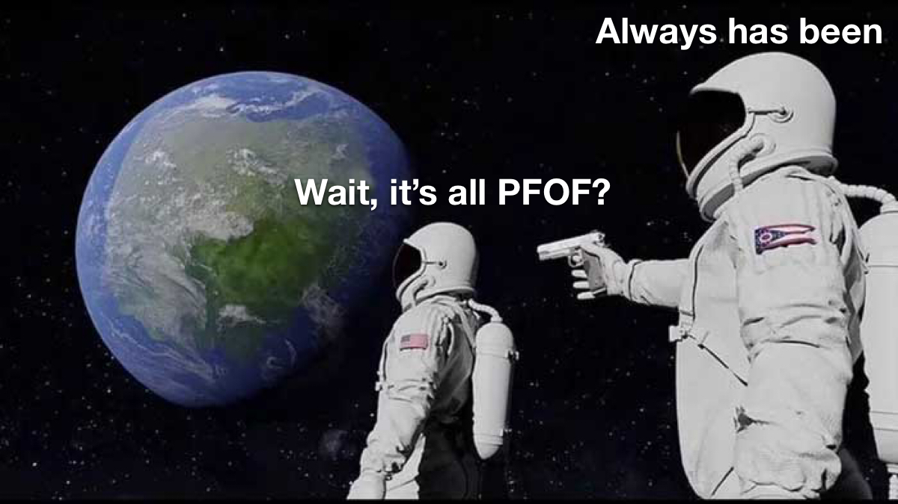

# Notes on UNIchain

I read Dan Elitzer's "The Inevitability of UNIchain" ([go read it](https://medium.com/nascent-xyz/the-inevitability-of-unichain-bc600c92c5c4)) the day it was published and have been chewing on it and the responses since.

> The primary pushback I get when presenting this thesis to folks who are not yet appchain-pilled is that moving to an appchain breaks composability. (Trust me, I’m [very aware](https://tokeneconomy.co/superfluid-collateral-in-open-finance-8c3db15efac) of the [benefits of composability](https://newsletter.banklesshq.com/p/aquaponic-yield-farming).) My response is that we’re already in a thoroughly multi-chain world, where the majority of all economic activity in crypto is clearly not all going to happen on a single chain.

> once applications reach a certain size, it starts to become increasingly important to have more direct control over their access–and their users’ costs for accessing–blockspace. The solution to this is a chain or rollup where access to blockspace is managed by validators whose primary concern is the success of a single application–their own.

Blockspace is fundamentally scarce. Pricing is needed to ensure the integrity of the network. As a result, transactions are rivalrous -- only so many entities can access the state per block, and they must pay the market rate to do so.

Radically different applications may not be rivalrous in their transaction demands. An arb bot exchanging between Uniswap and Binance isn't really competitive with a user borrowing DAI against ETH on MakerDAO. An oracle update in an L2 lending market already doesn't compete with an L1 NFT mint for gas.

Uniswap is one of the few DeFi applications with robust unincentivized usage. The technology is part of its strength, but its cultural brand is also key. How much is uniswap.org worth?

# Multilayered Applications

The security demand and finality time required for different applications is highly variable, potentially even for different products under the same governance structure. An integrated design process is of great interest, extending all the way from the front end to L1.

The user journey starts by downloading a mobile wallet, called Uni. Through an integration with Circle or other provider, the user can purchase stablecoins with a bank card after undergoing KYC, or transfer in crypto from another source.

The Uni app provides a simple and clean trading interface much like the Uniswap web app. The Uni app is a smart wallet that is also a bridge smart contract, so that by default funds sent to the app on L1 end up in on UNIchain. UNIchain can also be accessed through other clients.

UNIchain functions as Dan described, and has preferred access to L1 Uniswap liquidity.

> Second, controlling the validators/sequencers means that UNI holders would be able to take steps to minimize the MEV cost to traders, such as by implementing threshold encryption (e.g., Osmosis) or batch swaps that execute all trades between assets in a block at the same price (e.g., CoW Protocol). Reduction in MEV would make Uniswap a more efficient trading venue, but to the extent that MEV cannot be entirely eliminated, at least a Flashbots Auction-style system would ensure that much of the MEV could be internalized to UNI holders/validators rather than given away to ETH holders/validators. This ends up being akin to a form of Payment for Order Flow (PFOF).

If a condition arises such that ETH on UNIchain is worth $1 more than ETH on L1, UNIchain begins an MEV auction, such that the price difference never rises above the minimum arbitrage threshold. L1 Uniswap v4 gives UNIchain priority access to its liquidity, minimizing MEV leakage to ETH validators.

Users who onboard either through the UNI app or pass another Sybil resistance check can offboard without withdrawal delays and at no cost up to a limit using a Unibridge. Other users will have ordinary rollup liquidity constraints, or can use a third party bridge provider.

On Unichain, LPs can opt to automatically sync their prices with L1 Uniswap v4 or with any other data source reported by the Unioracle. The Unioracle allows UNI stakers to report aggregated price data.

Here UNI does quadruple duty as DEX governance token, validator/sequencer token, bridge bond token, and oracle token. Some will raise an eyebrow and feel I'm taking it to a fanciful extreme, but the point is that there are strong product advantages to integrated cross layer design.

# Cross Layer is Scary

Volt Protocol is in the process of deprecating support for Arbitrum, mostly because of the added risk of maintaining separate systems and instances on multiple chains. The risks of the system I'm describing above are not to be taken lightly.

There is a lot of decentralization middle ground between Binance Smart Chain and Uniswap v3, and valuable market share waiting to claim. That said, rollups are immature, and anything strongly reliant on liveness should be treated with some fear on L2, such as highly leveraged borrow or lending, market making, perps, etc. Let alone operations reliant on cross layer state.

Along with accidental uptime failures, there is the risk of denial of service attacks on sequencers. Until existing rollups demonstrate robust decentralization and uninterrupted liveness for extended periods, anything more complicated such as dedicated appchains or multilayer integrated systems will remain spooky.

