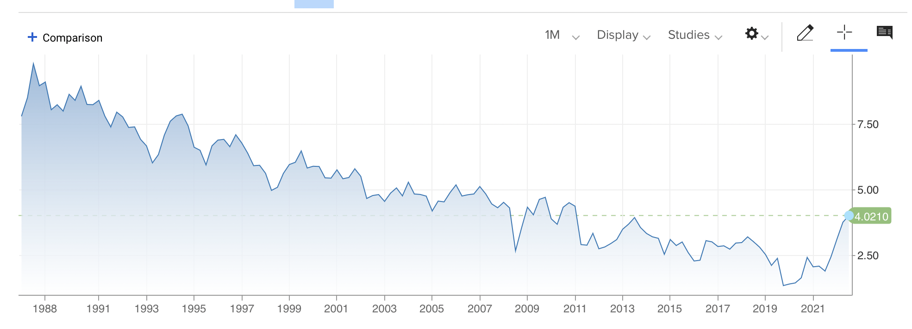
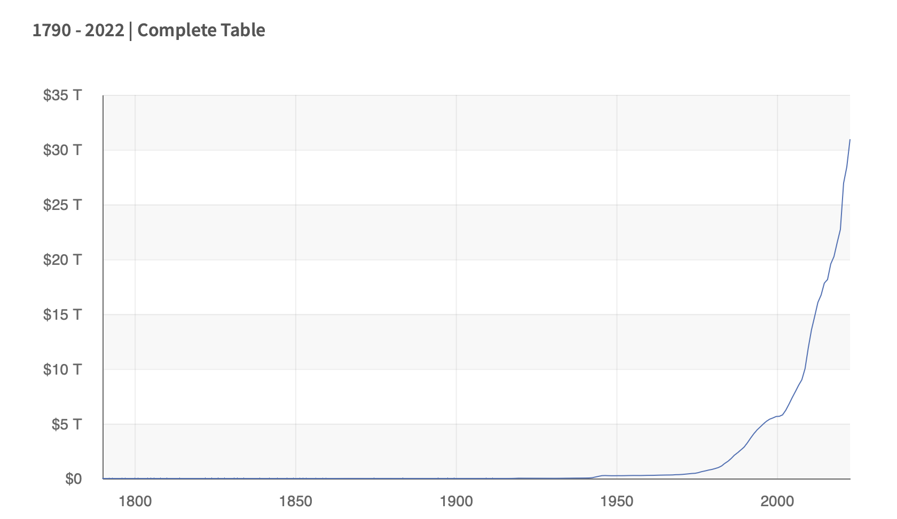

# Money Creation, Rates, and Risk

There are countless moving parts in the economy, making it tricky to untangle the threads or understand cause and effect. Many blame the '[Great Recession](https://en.wikipedia.org/wiki/Great_Recession)' on the excess and irresponsible lending of banks, and wild financial speculation in mortgage backed securities.

On November 15, 2008 (not two months from the Genesis Block) [the G20 characterized the situation](https://georgewbush-whitehouse.archives.gov/news/releases/2008/11/20081115-1.html) as follows:

>  During a period of strong global growth, growing capital flows, and prolonged stability earlier this decade, market participants sought higher yields without an adequate appreciation of the risks and failed to exercise proper due diligence.  At the same time, weak underwriting standards, unsound risk management practices, increasingly complex and opaque financial products, and consequent excessive leverage combined to create vulnerabilities in the system.  Policy-makers, regulators and supervisors, in some advanced countries, did not adequately appreciate and address the risks building up in financial markets, keep pace with financial innovation, or take into account the systemic ramifications of domestic regulatory actions.

## We're Skeptics Around These Parts

We're not here to dispute that various entities overextended themselves in subprime mortgage exposure. We'd prefer to see nature take its course with bad banks than a centralized force prop them up. But was the bust truly caused by the greed and excess of market participants? We think not.

First let's take note that market actors have threshold returns that they must clear. Traditional banks have expenses like rent for branch locations, salaries for tellers and bankers, ATM locations, armored cars, and postage costs. While they can make efforts to lower these, such as moving towards more online and paperless banking, the fact remains that these costs generally tend to go up over time with inflation, and is otherwise fairly stable.

For banks, it's therefore a big problem if interest rates go too low, as they'll be unable to obtain a large enough profit on their deposits to cover their fixed costs. Therefore, generating enough yield on long duration instruments is essential to their risk management.

This argument originates in [Banking on Deposits: Maturity Transformation without Interest Rate Risk](https://pages.stern.nyu.edu/~asavov/alexisavov/Alexi_Savov_files/BankingOnDeposits.pdf) by [Drechsler](https://fnce.wharton.upenn.edu/profile/idrechsl/#research), [Sahov](https://pages.stern.nyu.edu/~asavov/alexisavov/Alexi_Savov.html), and [Schnabl](https://www.stern.nyu.edu/faculty/bio/philipp-schnabl). It's worth a read if you enjoy this kind of thing.

When prevailing market rates decline, banks have little choice but to venture farther out on the risk curve to obtain the necessary return to support their fixed costs.

We must wonder whether 5% was a fair 30 year Treasury yield in 2007, given an average inflation of 2.42% per year since then. As I see it, governments all over the world have been putting a squeeze on the financial system with lowered rates and steady or rising inflation. [Debasement](https://en.wikipedia.org/wiki/Debasement) is an ancient practice, it's just more sophisticated now. Dilution -> Inflation -> Yield Manipulation.

## Where does money come from?
> big fish, small pond

I've been spending time recently [arguing that commercial banks do not and cannot create money](semantics.md). To be precise, they create neither money nor currency, only allocate money or credit.

This article continues on this theme, with the central claim that unregulated free currency issue and credit markets produce healthy economic outcomes. The greatest threat to monetary stability is the state and central bank, not the free market.

What is the 'gold' in our fiat currency system?

Central banks create unbacked currency and use it to purchase government debt, and sometimes other assets. As under the gold standard a mint shapes gold into coins with denominations corresponding to standard weights, the central bank takes securities and dispenses dollars or other national currency. While you might not be able to pay with US Treasuries at the grocery store, nor could you have readily purchased your groceries with a gold bar in historical times. On this note, the reader might be interested to explore historical examples of small change shortages and the resort to alternative exchange media in Selgin's [Good Money: Birmingham Button Makers, the Royal Mint, and the Beginnings of Modern Coinage, 1775–1821](https://www.cato.org/books/good-money-birmingham-button-makers-royal-mint-beginnings-modern-coinage-1775-1821).

Under the fiat system, then, the gold substitute or real base money is *government debt* and whatever other quasi-government securities such as mortgage backed securities the central bank will accept. Units like the dollar are standard amounts of the base money, which is debt backed by the state. The money supply expands as the state takes on more debt, and would contract it if it ever paid off its debts. Whether the central bank chooses to mint currency against the base money is irrelevant to the fact that if excess money (government debt) is created beyond what the market demands, it will experience inflation (increased yield on bonds). If insufficient money (government debt) is created to meet the market demand, deflation occurs. If the central bank attempts to buy up government securities without offering redemption, or vice versa (sell off its holdings for currency) it merely transfers the inflation to the currency unit or vice versa. Not to say that these actions are free of consequences, the point is that the central bank has influence rather than control and cannot create money, only currency.

Once again, the moment of money creation is when the state issues debt, the moment of currency creation is when the Central Bank mints using this debt as backing, or buys this debt on the market with newly minted cash. The currency issued by the central bank is merely a form of this money.

Unsurprisingly, with their respective publics accepting their debt as money, nations all over the world have taken advantage of this fact to balloon their balance sheets. Globally, corporate debt and government debt are roughly equal in total size. 

>Historical Debt Outstanding, retrieved from Fiscal Data
https://fiscaldata.treasury.gov/datasets/historical-debt-outstanding/, Oct 18, 2022

If your first thought on seeing this chart was that rate of growth can't last forever, you are not alone. In 1900, the US government debt was about two billion dollars in face value, at the time still pegged to and in theory redeemable for more than 16 million pounds of gold. Today, that amount of gold is worth 130 billion dollars, less than a hundredth of the 31 trillion dollar government debt. In dollar terms, the debt has increased ten thousand fold.

Any analysis of volatility events in the money markets that does not begin with scrutiny of the actions of the government and the central banks ought to be subject to question. Given the enormous power of these entities, it is somewhere between absurd and sinister for them to lay the blame on market participants for what their own monetary policy has wrought.